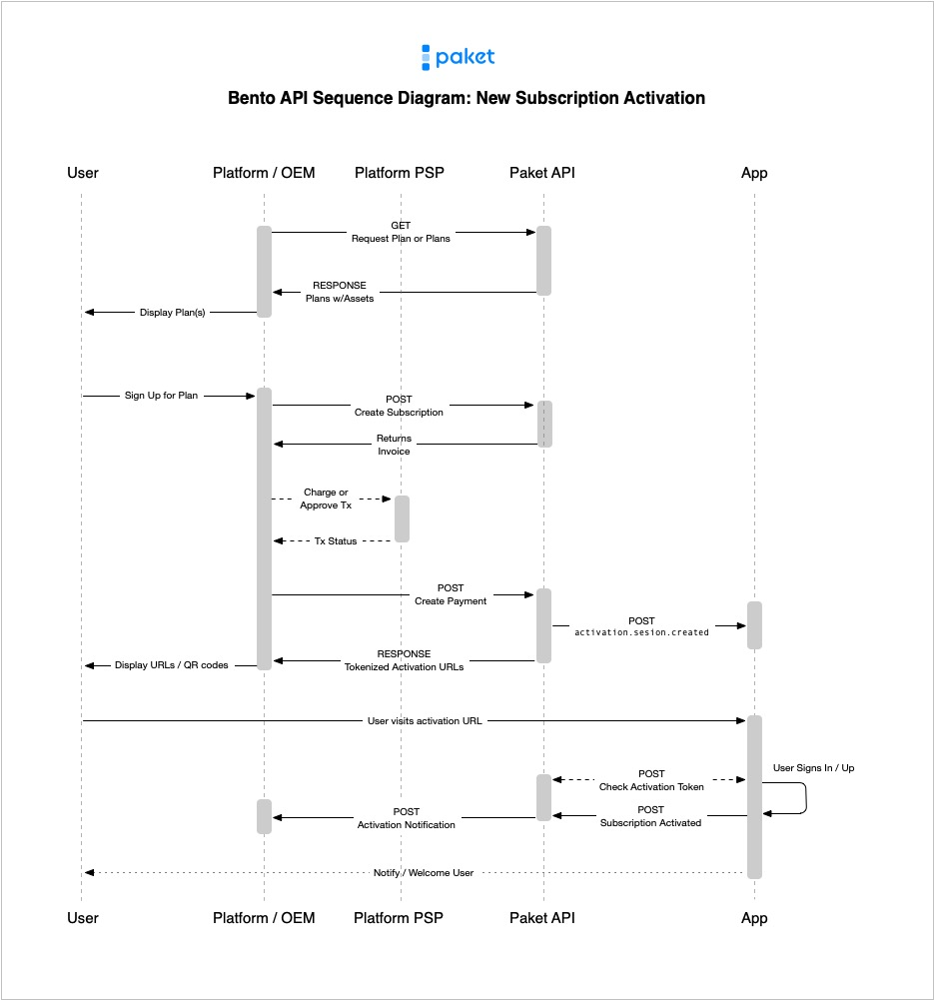

# Bento (Bento)

## Overview

The Paket License API (Bento) is a license and subscription orchestration service that enables Platforms and Publishers to offer comprehensive subscription bundles through a unified catalog via their native billing and identity systems. This API provides access to curated plan offerings, subscription management, and invoice management capabilities that power the Paket subscription marketplace.

**For Platforms**, Bento offers a seamless way to integrate third-party subscription services into their ecosystem, providing users with bundled offerings that combine multiple streaming services, apps, and digital content into single, manageable subscriptions.

**For Publishers**, Bento ensures consistent subscription management across all Paket-integrated platforms, with unified billing, activation workflows, and revenue distribution handled automatically through the Paket infrastructure.

To get started, a Publisher must first configure their service via the Paket Publisher Portal. There, Publishers will be able to set up webhook endpoints, security, and API clients through which the service will communicate with the Paket service. It is in the Publisher Portal where Publishers will be able to set up product licenses and assign them for sale through approved Platform partners.

It is also in the Paket Publisher Portal where Platforms will configure API clients and configure plans and bundles for sale via the Paket API. 

### Subscription Activation Flow

Paket's subscription orchestration service works independently of the Platform's payment and identity services and the app Publishers' respective identity services. This affords both Platform and Publisher direct ownership of the respective user's accounts and enhanced privacy for the end user.

<p style="margin-top:20px;margin-bottom:20px">
  
</p>

#### Create New Subscription

1. **Platform Creates Subscription**: Platform calls `POST /v1/catalog/subscriptions` with user's session ID and selected plan
2. **Invoice Generation**: Paket automatically generates the first invoice for the billing period
3. **Platform Processes Payment**: Platform collects payment through their payment service provider (PSP)
4. **Payment Recording**: Platform posts payment result to `POST /v1/catalog/subscriptions/{subscription_id}/invoices/{invoice_id}/payments`
5. **Subscription Activation**: On successful payment, Paket returns activation URLs for each of the plan's products and triggers the app activation flow
6. **Publisher Notification**: Publishers receive `activation.session.created` webhooks for new subscriptions requiring activation. The webhook includes a `jti` (JWT identifier) for security validation.


#### Product Activation

1. **User Arrives**: User visits activation URL with their unique activation code
3. **Code Validation**: Publisher validates the activation code via `POST /v1/catalog/activation/exchange`, which returns the purchased product details and the `jti` for cross-reference validation.
4. **Account Setup**: Publisher validates the product and completes user sign-up or sign-in process
5. **Activation Confirmation**: Publisher calls `PUT /v1/catalog/activation/{session_id}/items/{item_id}` to confirm activation.
6. **Service Provisioning**: Publisher provisions the service for the activated user


> Request to Exchange Activation Code

```shell
curl --location --request POST 'https://api.paket.tv/v1/catalog/activation/exchange' \
  --header 'Content-Type: application/json' \
  --header 'Authorization: Basic <credentials>' \
  --data '{
    "activation_code": "AC_A3F2B7C9_D4E1F8A2"
  }'
```

> Response with Product Details

```json
{
  "activation_session_id": "AS479027832456789123",
  "app_id": "AP468442205989113856",
  "product_id": "PR469716925099413504",
  "subscription_id": "SUB479027832035610624",
  "platform_id": "PL468440696748511232",
  "jti": "at_479027832567890234",
  "product": {
    "product_id": "PR469716925099413504",
    "product_name": "Disney+ Basic",
    "internal_id": "disney_basic_tier1"
  }
}
```

#### Important Notes

- **Time-Limited**: Activation codes expire after 7 days
- **Single Use**: Each code can only be exchanged once
- **No Secrets Required**: Simply exchange the code as received from the user
- **Automatic Validation**: Paket handles all security validation internally

<aside class="notice">
After successfully exchanging the activation code and completing user account setup, publishers must confirm the activation by calling PUT /v1/catalog/activation/{session_id}/items/{item_id} to update the activation status.
</aside>

### Subscription Renewal Flow

Paket handles subscription renewals automatically through its billing orchestration system. The renewal process ensures continuity of service and a single source of truth while maintaining proper billing cycles and platform revenue distribution.

<p style="margin-top:20px;margin-bottom:20px">
  
</p>

1. **Invoice Generation**: On the billing date, Paket automatically generates a new invoice for the next billing cycle
2. **Platform Notification**: Platform receives notification about the new invoice
3. **Payment Processing**: Platform collects payment through their payment service provider (PSP) 
4. **Payment Confirmation**: Platform records payment result via `POST /v1/catalog/subscriptions/{subscription_id}/invoices/{invoice_id}/payments`
5. **Renewal Completion**: On successful payment, subscription billing cycle advances and service continues
6. **Publisher Updates**: Publishers receive `subscription.renewed` webhook confirming successful renewal

### Subscription Cancellation Flow

Subscription cancellations can be initiated either by platforms (e.g., at user's request) or programmatically when an unpaid invoice lapses its grace period and are handled gracefully to ensure proper service termination and final billing reconciliation.

<p style="margin-top:20px;margin-bottom:20px">
  
</p>

1. **Cancellation Request**: Platform initiates cancellation via `PUT /v1/catalog/subscriptions/{subscription_id}` with status `"canceled"`
2. **Final Billing**: Paket calculates any pro-rated charges or credits based on cancellation timing
3. **Publisher Notification**: Publishers receive `subscription.canceled` webhook event with cancellation details
4. **Service Termination**: Publishers deactivate services for the canceled subscription
5. **Grace Period**: Optional grace period allows users to maintain access until the end of the current billing period
6. **Final Invoice**: If applicable, Paket generates a final invoice for any outstanding charges
7. **Subscription Closure**: Subscription status changes to `"canceled"` and no future invoices are generated

<aside class="warning">
Publishers should immediately revoke access to services upon receiving the subscription.canceled webhook, unless the platform implements an end-of-period grace period policy.
</aside>

## Plans

Plans define the subscription offerings available through the Paket catalog, including pricing, billing cycles, and bundled services.

### The Plan Object

The Plan object represents the template from which a Subcription is created. It itemizes which licenses are include in the plan, pricing, availability, localizations, billing cycles, bundled services configuration, and more. 

> The Plan Object

```json
{
  "plan_id": "427944e5ba9e",
  "name": "Disney+, Hulu, HBO Max Bundle",
  "plan_type": "sub_bundle",
  "status": "active",
  "platform_id": "PL468440696748511232",
  "billing_frequency": { 
    "unit": "month", 
    "value": 1 
  },
  "free_trial_days": 7,
  "grace_period_days": 7,
  "media": {
    "promo_4k_1x": "https://media.paket.tv/media/plans/PL468440696748511232/427944e5ba9e/promo_4k@1x.png",
    "promo_2k_1x": "https://media.paket.tv/media/plans/PL468440696748511232/427944e5ba9e/promo_2k@1x.png"
  },
  "prices": {
    "US": [
      {
        "order": 1,
        "billing_cycles": 3,
        "price": {
          "price_in_cents": 1699,
          "tier_id": "1699",
          "currency_code": "USD",
          "price": 16.99
        }
      }
    ]
  },
  "localizations": {
    "en-us": {
        "description": "The bundle with everything you need",
        "display_name": "Disney+, Hulu, HBO Max Bundle"
    }
  },
  "plan_items": [
    {
        "status": "active",
        "price_wholesale": {
            "price": 4.56,
            "price_in_cents": 456,
            "currency_code": "USD"
        },
        "name": "Disney+ Basic",
        "app_id": "AP468442205989113856",
        "product_id": "PR469716925099413504",
        "localizations": {
            "en-us": {
                "description": "Disney+ Basic With Ads",
                "display_name": "Disney+ Basic"
            }
        },
        "prices": {
            "US": {
                "price_in_cents": 999,
                "tier_id": "999",
                "currency_code": "USD",
                "price": 9.99
            }
        },
        "app": {
            "id": "AP468442205989113856",
            "name": "Disney+",
            "media": {
                "icon_1x": "https://media.paket.tv/media/apps/AP468442205989113856/icon@1x.png",
                "icon_2x": "https://media.paket.tv/media/apps/AP468442205989113856/icon@2x.png",
                "icon_3x": "https://media.paket.tv/media/apps/AP468442205989113856/icon@3x.png",
                "logo_dark_1x": "https://media.paket.tv/media/apps/AP468442205989113856/logo_dark@1x.png",
                "logo_light_1x": "https://media.paket.tv/media/apps/AP468442205989113856/logo_light@1x.png",
                "tile_1x": "https://media.paket.tv/media/apps/AP468442205989113856/tile@1x.png",
                "tile_2x": "https://media.paket.tv/media/apps/AP468442205989113856/tile@2x.png"
            },
            "status": "live"
        }
    },
    ...
  ],
  "metadata": {},
  "created_at": "2024-01-15T10:30:00.000Z",
  "updated_at": "2024-01-17T07:28:00.000Z"
}
```

**Attributes**

**`plan_id`** <span style='margin: 0 5px;font-size:.9em'>string</span>  
The unique identifier for the plan.

**`name`** <span style='margin: 0 5px;font-size:.9em'>string</span>  
The internal name of the plan.

**`plan_type`** <span style='margin: 0 5px;font-size:.9em'>string</span>  
The type of plan, which can be one of the following enum values:

- `sub_bundle` - Multiple subscription services bundled together
- `sub_single` - Single subscription service

**`status`** <span style='margin: 0 5px;font-size:.9em'>string</span>  
The current status of the plan:

- `active` - Available for new subscriptions
- `inactive` - Not available for new subscriptions
- `deprecated` - Being phased out

**`platform_id`** <span style='margin: 0 5px;font-size:.9em'>string</span>  
The platform identifier associated with this plan.

**`billing_frequency`** <span style='margin: 0 5px;font-size:.9em'>object</span>  
The billing cycle configuration:

&nbsp;&nbsp;&nbsp;**`unit`** <span style='margin: 0 5px;font-size:.9em'>string</span>  
&nbsp;&nbsp;&nbsp;Billing unit (`month`, `year`)

&nbsp;&nbsp;&nbsp;**`value`** <span style='margin: 0 5px;font-size:.9em'>integer</span>  
&nbsp;&nbsp;&nbsp;Billing frequency value (1, 3, 6, 12)

**`free_trial_days`** <span style='margin: 0 5px;font-size:.9em'>integer</span>  
Number of free trial days offered (0 if no trial).

**`grace_period_days`** <span style='margin: 0 5px;font-size:.9em'>integer</span>  
Number of days after payment failure before subscription suspension.

**`media`** <span style='margin: 0 5px;font-size:.9em'>object</span>  
URLs to promotional media assets for the plan:

&nbsp;&nbsp;&nbsp;**`promo_4k_1x`** <span style='margin: 0 5px;font-size:.9em'>string</span>  
&nbsp;&nbsp;&nbsp;4K promotional image URL

&nbsp;&nbsp;&nbsp;**`promo_2k_1x`** <span style='margin: 0 5px;font-size:.9em'>string</span>  
&nbsp;&nbsp;&nbsp;2K promotional image URL

**`prices`** <span style='margin: 0 5px;font-size:.9em'>object</span>  
Regional pricing information organized by country code. Each region contains an array of pricing phases:

&nbsp;&nbsp;&nbsp;**`order`** <span style='margin: 0 5px;font-size:.9em'>integer</span>  
&nbsp;&nbsp;&nbsp;The sequence order of the pricing phase

&nbsp;&nbsp;&nbsp;**`billing_cycles`** <span style='margin: 0 5px;font-size:.9em'>integer</span>  
&nbsp;&nbsp;&nbsp;Number of cycles this price applies to (null if indefinite)

&nbsp;&nbsp;&nbsp;**`price`** <span style='margin: 0 5px;font-size:.9em'>object</span>  
&nbsp;&nbsp;&nbsp;Price object containing:

&nbsp;&nbsp;&nbsp;&nbsp;&nbsp;&nbsp;**`price_in_cents`** <span style='margin: 0 5px;font-size:.9em'>integer</span>  
&nbsp;&nbsp;&nbsp;&nbsp;&nbsp;&nbsp;Price in cents as an integer

&nbsp;&nbsp;&nbsp;&nbsp;&nbsp;&nbsp;**`tier_id`** <span style='margin: 0 5px;font-size:.9em'>string</span>  
&nbsp;&nbsp;&nbsp;&nbsp;&nbsp;&nbsp;Pricing tier identifier

&nbsp;&nbsp;&nbsp;&nbsp;&nbsp;&nbsp;**`currency_code`** <span style='margin: 0 5px;font-size:.9em'>string</span>  
&nbsp;&nbsp;&nbsp;&nbsp;&nbsp;&nbsp;Three-letter ISO currency code

&nbsp;&nbsp;&nbsp;&nbsp;&nbsp;&nbsp;**`price`** <span style='margin: 0 5px;font-size:.9em'>number</span>  
&nbsp;&nbsp;&nbsp;&nbsp;&nbsp;&nbsp;Price as a decimal

**`localizations`** <span style='margin: 0 5px;font-size:.9em'>object</span>  
Localized content organized by language code (e.g., "en-us"):

&nbsp;&nbsp;&nbsp;**`description`** <span style='margin: 0 5px;font-size:.9em'>string</span>  
&nbsp;&nbsp;&nbsp;Localized description of the plan

&nbsp;&nbsp;&nbsp;**`display_name`** <span style='margin: 0 5px;font-size:.9em'>string</span>  
&nbsp;&nbsp;&nbsp;Localized display name for the plan

**`plan_items`** <span style='margin: 0 5px;font-size:.9em'>array</span>  
Array of products or entitlements included in the plan. Each item contains:

&nbsp;&nbsp;&nbsp;**`status`** <span style='margin: 0 5px;font-size:.9em'>string</span>  
&nbsp;&nbsp;&nbsp;Item status (`active`, `inactive`)

&nbsp;&nbsp;&nbsp;**`price_wholesale`** <span style='margin: 0 5px;font-size:.9em'>object</span>  
&nbsp;&nbsp;&nbsp;Wholesale pricing information with price, price_in_cents, and currency_code

&nbsp;&nbsp;&nbsp;**`name`** <span style='margin: 0 5px;font-size:.9em'>string</span>  
&nbsp;&nbsp;&nbsp;Internal name of the product

&nbsp;&nbsp;&nbsp;**`app_id`** <span style='margin: 0 5px;font-size:.9em'>string</span>  
&nbsp;&nbsp;&nbsp;Associated app identifier

&nbsp;&nbsp;&nbsp;**`product_id`** <span style='margin: 0 5px;font-size:.9em'>string</span>  
&nbsp;&nbsp;&nbsp;Unique product identifier

&nbsp;&nbsp;&nbsp;**`localizations`** <span style='margin: 0 5px;font-size:.9em'>object</span>  
&nbsp;&nbsp;&nbsp;Localized content for the product (description and display_name)

&nbsp;&nbsp;&nbsp;**`prices`** <span style='margin: 0 5px;font-size:.9em'>object</span>  
&nbsp;&nbsp;&nbsp;Regional retail pricing by country

&nbsp;&nbsp;&nbsp;**`app`** <span style='margin: 0 5px;font-size:.9em'>object</span>  
&nbsp;&nbsp;&nbsp;App object containing:

&nbsp;&nbsp;&nbsp;&nbsp;&nbsp;&nbsp;**`id`** <span style='margin: 0 5px;font-size:.9em'>string</span>  
&nbsp;&nbsp;&nbsp;&nbsp;&nbsp;&nbsp;App identifier

&nbsp;&nbsp;&nbsp;&nbsp;&nbsp;&nbsp;**`name`** <span style='margin: 0 5px;font-size:.9em'>string</span>  
&nbsp;&nbsp;&nbsp;&nbsp;&nbsp;&nbsp;App name

&nbsp;&nbsp;&nbsp;&nbsp;&nbsp;&nbsp;**`media`** <span style='margin: 0 5px;font-size:.9em'>object</span>  
&nbsp;&nbsp;&nbsp;&nbsp;&nbsp;&nbsp;App media assets (icons, logos, tiles)

&nbsp;&nbsp;&nbsp;&nbsp;&nbsp;&nbsp;**`status`** <span style='margin: 0 5px;font-size:.9em'>string</span>  
&nbsp;&nbsp;&nbsp;&nbsp;&nbsp;&nbsp;App status (`live`, `inactive`)

**`created_at`** <span style='margin: 0 5px;font-size:.9em'>string</span>  
ISO 8601 timestamp when the plan was created.

**`updated_at`** <span style='margin: 0 5px;font-size:.9em'>string</span>  
ISO 8601 timestamp when the plan was last updated.


### List Plans

> Endpoint

```
GET https://api.paket.tv/v1/catalog/plans
```

Retrieves a list of available Plans from the catalog.

> GET https://api.paket.tv/v1/catalog/plans

```curl
curl --location 'https://api.paket.tv/v1/catalog/plans' \
  --header 'Accept: application/json' \
  --header 'Authorization: Basic <credentials>'
``` 

> Response

```http
HTTP/1.1 200 OK
Content-Type: application/json
{
    "items": [
        {
            "billing_frequency": {
                "unit": "month",
                "value": 1
            },
            "free_trial_days": 0,
            "plan_type": "sub_bundle",
            "updated_at": "2025-08-15T14:59:34+00:00",
            "platform_id": "PL468440696748511232",
            "name": "Disney+, Hulu, HBO Max Bundle",
            "media": {
                "promo_4k_1x": "https://media-dev.paket.tv/media/plans/PL468440696748511232/427944e5ba9e/promo_4k@1x.png",
                "promo_2k_1x": "https://media-dev.paket.tv/media/plans/PL468440696748511232/427944e5ba9e/promo_2k@1x.png"
            },
            "plan_id": "427944e5ba9e",
            "status": "active",
            "localizations": {
                "en-us": {
                    "description": "The bundle with everything you need",
                    "display_name": "Disney+, Hulu, HBO Max Bundle"
                }
            },
            "prices": {
                "US": [
                    {
                        "order": 1,
                        "billing_cycles": null,
                        "price": {
                            "price_in_cents": 1699,
                            "tier_id": "1699",
                            "currency_code": "USD",
                            "price": 16.99
                        }
                    }
                ]
            }
            "created_at": "2025-07-20T04:17:16+00:00",
            "updated_at": "2025-08-20T02:11:13+00:00",
        }
    ],
    "total": 1,
    "next_key": null
}
```
\* required

**Headers**

**`Authorization`*** <span style='margin: 0 5px;font-size:.9em'>string</span>  
Your API credentials for authentication.

**Query Parameters**

**`limit`** <span style='margin: 0 5px;font-size:.9em'>integer</span>  
Optional. Number of plans to return (1-100, default: 25).

**`next_key`** <span style='margin: 0 5px;font-size:.9em'>integer</span>  
Optional. Pagination key from previous response.

**`language`** <span style='margin: 0 5px;font-size:.9em'>string or array</span>  
Optional. Language code(s) for localized content (default: ["en-us"]).

**`region`** <span style='margin: 0 5px;font-size:.9em'>string or array</span>  
Optional. Region code(s) to filter plans by availability (e.g., "US", "CA").

**Returns**

Returns an array of Plan objects (without `plan_items` array) available in the catalog.

### Get Plan

> Endpoint

```
GET https://api.paket.tv/v1/catalog/plans/:plan_id
```

Retrieves detailed information about a specific plan.

> GET https://api.paket.tv/v1/catalog/plans/:plan_id

```curl
curl --location 'https://api.paket.tv/v1/catalog/plans/427944e5ba9e' \
  --header 'Accept: application/json' \
  --header 'Authorization: Basic <credentials>'
``` 

> Response

```http
HTTP/1.1 200 OK
Content-Type: application/json
{
  "plan_id": "427944e5ba9e",
  "name": "Disney+, Hulu, HBO Max Bundle",
  "plan_type": "sub_bundle",
  "status": "active",
  "platform_id": "PL468440696748511232",
  "free_trial_days": 0,
  "grace_period_days": 7,
  "billing_frequency": {
    "unit": "month",
    "value": 1
  },
  "media": {
    "promo_4k_1x": "https://media.paket.tv/media/plans/PL468440696748511232/427944e5ba9e/promo_4k@1x.png",
    "promo_2k_1x": "https://media.paket.tv/media/plans/PL468440696748511232/427944e5ba9e/promo_2k@1x.png"
  },
  "prices": {
    "US": [
      {
        "order": 1,
        "billing_cycles": 3,
        "price": {
          "price_in_cents": 1699,
          "tier_id": "1699",
          "currency_code": "USD",
          "price": 16.99
        }
      }
    ]
  },
  "localizations": {
    "en-us": {
        "description": "The bundle with everything you need",
        "display_name": "Disney+, Hulu, HBO Max Bundle"
    }
  },
  "plan_items": [
    {
        "status": "active",
        "price_wholesale": {
            "price": 4.56,
            "price_in_cents": 456,
            "currency_code": "USD"
        },
        "name": "Disney+ Basic",
        "app_id": "AP468442205989113856",
        "product_id": "PR469716925099413504",
        "localizations": {
            "en-us": {
                "description": "Disney+ Basic With Ads",
                "display_name": "Disney+ Basic"
            }
        },
        "prices": {
            "US": {
                "price_in_cents": 999,
                "tier_id": "999",
                "currency_code": "USD",
                "price": 9.99
            }
        },
        "app": {
            "id": "AP468442205989113856",
            "name": "Disney+",
            "media": {
                "icon_1x": "https://media.paket.tv/media/apps/AP468442205989113856/icon@1x.png",
                "icon_2x": "https://media.paket.tv/media/apps/AP468442205989113856/icon@2x.png",
                "icon_3x": "https://media.paket.tv/media/apps/AP468442205989113856/icon@3x.png",
                "logo_dark_1x": "https://media.paket.tv/media/apps/AP468442205989113856/logo_dark@1x.png",
                "logo_light_1x": "https://media.paket.tv/media/apps/AP468442205989113856/logo_light@1x.png",
                "tile_1x": "https://media.paket.tv/media/apps/AP468442205989113856/tile@1x.png",
                "tile_2x": "https://media.paket.tv/media/apps/AP468442205989113856/tile@2x.png"
            },
            "status": "live"
        }
    },
    ...
  ],
  "created_at": "2024-01-15T10:30:00.000Z",
  "updated_at": "2024-01-17T07:28:00.000Z"
}
```
\* required

**Headers**

**`Authorization`*** <span style='margin: 0 5px;font-size:.9em'>string</span>  
Your API credentials for authentication.

**Path Parameters**

**`plan_id`*** <span style='margin: 0 5px;font-size:.9em'>string</span>  
The unique identifier of the plan to retrieve.


**Query Parameters**

**`region`** <span style='margin: 0 5px;font-size:.9em'>string</span>  
Optional. Region for pricing information (default: "US").

**Returns**

Returns a detailed Plan object with complete pricing, plan items, and phase information.

## Subscriptions

Subscriptions represent a relationship between users and plans, managing billing cycles, activation, invoices, and payments. In a typical configuration, Paket operates exclusively as the orchestration layer and the Platform acts as the Merchant of Record, determining when and if an invoice is taxable, in which juristiction, at what amount, and whether the tax should be applied exclusive or inclusive of the plan price. 

### The Subscription Object

The Subscription object represents an active or inactive Subscription to a Plan, tracking billing cycles, payment status, and activation state.

> The Subscription Object

```json
{
  "subscription_id": "SUB479027832035610624",
  "session_id": "SN468560588960960512",
  "plan_id": "427944e5ba9e",
  "platform_id": "PL468440696748511232",
  "status": "active",
  "activation_status": "pending",
  "payment_status": "paid",
  "billing": {
    "next_billing_date": "2025-09-14T20:45:35.064Z",
    "frequency": { "unit": "month", "value": 1 },
    "cycle_count": 1,
    "current_phase_id": "4282b4cfac23dc38",
    "grace_period_days": 7,
    "grace_period_end": "2025-09-21T20:45:35.064Z",
    "interval_days": 30
  },
  "trial": {
    "days": 7,
    "end_date": "2025-08-21T20:45:35.064Z"
  },
  "period": {
    "start": "2025-08-14T20:45:35.065Z",
    "end": "2025-09-14T20:45:35.064Z"
  },
  "tax": {
    "rate": 0.0875,
    "type": "sales_tax",
    "jurisdiction": "CA-Los Angeles",
    "behavior": "exclusive",
    "note": ""
  },
  "plan": {
    "name": "Disney+, Hulu, HBO Max Bundle",
    "type": "sub_bundle"
  },
  "cancellation": {
    "cancel_at_period_end": false,
    "canceled_at": null,
    "ended_at": null
  },
  "proration_credit": 0,
  "metadata": {},
  "device_info": {},
  "created_ip": "75.85.168.125",
  "updated_ip": "75.85.168.125",
  "created_at": "2025-08-14T20:45:35.065Z",
  "updated_at": "2025-08-14T21:00:00.000Z"
}
```

**Attributes**

**`subscription_id`** <span style='margin: 0 5px;font-size:.9em'>string</span>  
The unique identifier for the subscription (prefixed with SUB).

**`session_id`** <span style='margin: 0 5px;font-size:.9em'>string</span>  
The session identifier associated with this subscription.

**`plan_id`** <span style='margin: 0 5px;font-size:.9em'>string</span>  
The plan identifier this subscription is for.

**`billing`** <span style='margin: 0 5px;font-size:.9em'>object</span>  
Billing information:

&nbsp;&nbsp;&nbsp;**`next_billing_date`** <span style='margin: 0 5px;font-size:.9em'>string</span>  
&nbsp;&nbsp;&nbsp;ISO 8601 timestamp of the next billing date

&nbsp;&nbsp;&nbsp;**`frequency`** <span style='margin: 0 5px;font-size:.9em'>object</span>  
&nbsp;&nbsp;&nbsp;Billing frequency configuration with `unit` and `value`

&nbsp;&nbsp;&nbsp;**`cycle_count`** <span style='margin: 0 5px;font-size:.9em'>number</span>  
&nbsp;&nbsp;&nbsp;Total number of completed billing cycles

&nbsp;&nbsp;&nbsp;**`current_phase_id`** <span style='margin: 0 5px;font-size:.9em'>string</span>  
&nbsp;&nbsp;&nbsp;The current phase price identifier

&nbsp;&nbsp;&nbsp;**`grace_period_days`** <span style='margin: 0 5px;font-size:.9em'>number</span>  
&nbsp;&nbsp;&nbsp;Grace period during which subscription remains active after failed payment

&nbsp;&nbsp;&nbsp;**`grace_period_end`** <span style='margin: 0 5px;font-size:.9em'>string</span>  
&nbsp;&nbsp;&nbsp;ISO 8601 timestamp of the current grace period end

&nbsp;&nbsp;&nbsp;**`interval_days`** <span style='margin: 0 5px;font-size:.9em'>number</span>  
&nbsp;&nbsp;&nbsp;Billing interval in days

**`platform_id`** <span style='margin: 0 5px;font-size:.9em'>string</span>  
The platform identifier issuing the plan.

**`status`** <span style='margin: 0 5px;font-size:.9em'>string</span>  
Current subscription status:

- `trialing` - In free trial period
- `active` - Active and paid
- `past_due` - Payment failed but in grace period
- `canceled` - Canceled by user
- `unpaid` - Payment required
- `paused` - Temporarily paused

**`activation_status`** <span style='margin: 0 5px;font-size:.9em'>string</span>  
Publisher activation status:

- `pending` - Awaiting activation
- `partial` - Partially activated (some services activated but not all)
- `completed` - Successfully activated
- `failed` - Activation failed

**`payment_status`** <span style='margin: 0 5px;font-size:.9em'>string</span>  
Current payment status:

- `paid` - Fully paid
- `unpaid` - Payment pending
- `scheduled` - Payment scheduled
- `no_payment_required` - Free or trial period
- `processing` - Payment in progress
- `failed` - Payment failed
- `canceled` - Payment canceled

**`trial`** <span style='margin: 0 5px;font-size:.9em'>object</span>  
Trial information (only present if trial exists):

&nbsp;&nbsp;&nbsp;**`days`** <span style='margin: 0 5px;font-size:.9em'>number</span>  
&nbsp;&nbsp;&nbsp;Days included in free trial

&nbsp;&nbsp;&nbsp;**`end_date`** <span style='margin: 0 5px;font-size:.9em'>string</span>  
&nbsp;&nbsp;&nbsp;ISO 8601 timestamp of the trial period end

**`period`** <span style='margin: 0 5px;font-size:.9em'>object</span>  
Billing period dates:

&nbsp;&nbsp;&nbsp;**`start`** <span style='margin: 0 5px;font-size:.9em'>string</span>  
&nbsp;&nbsp;&nbsp;ISO 8601 start of current billing period

&nbsp;&nbsp;&nbsp;**`end`** <span style='margin: 0 5px;font-size:.9em'>string</span>  
&nbsp;&nbsp;&nbsp;ISO 8601 end of current billing period

**`tax`** <span style='margin: 0 5px;font-size:.9em'>object</span>  
Tax information:

&nbsp;&nbsp;&nbsp;**`rate`** <span style='margin: 0 5px;font-size:.9em'>number</span>  
&nbsp;&nbsp;&nbsp;Applied tax rate (0-1, e.g., 0.0875 for 8.75%)

&nbsp;&nbsp;&nbsp;**`type`** <span style='margin: 0 5px;font-size:.9em'>string</span>  
&nbsp;&nbsp;&nbsp;Type of tax (`sales_tax`, `vat`, `gst`, `pst`, `hst`, `none`)

&nbsp;&nbsp;&nbsp;**`jurisdiction`** <span style='margin: 0 5px;font-size:.9em'>string</span>  
&nbsp;&nbsp;&nbsp;Tax jurisdiction code

&nbsp;&nbsp;&nbsp;**`behavior`** <span style='margin: 0 5px;font-size:.9em'>string</span>  
&nbsp;&nbsp;&nbsp;Tax collection behavior (`inclusive`, `exclusive`, `none`)

&nbsp;&nbsp;&nbsp;**`note`** <span style='margin: 0 5px;font-size:.9em'>string</span>  
&nbsp;&nbsp;&nbsp;Additional tax notes

**`plan`** <span style='margin: 0 5px;font-size:.9em'>object</span>  
Plan information:

&nbsp;&nbsp;&nbsp;**`name`** <span style='margin: 0 5px;font-size:.9em'>string</span>  
&nbsp;&nbsp;&nbsp;The plan name

&nbsp;&nbsp;&nbsp;**`type`** <span style='margin: 0 5px;font-size:.9em'>string</span>  
&nbsp;&nbsp;&nbsp;Plan type (`sub_bundle`, `sub_single`)

**`cancellation`** <span style='margin: 0 5px;font-size:.9em'>object</span>  
Cancellation information:

&nbsp;&nbsp;&nbsp;**`cancel_at_period_end`** <span style='margin: 0 5px;font-size:.9em'>boolean</span>  
&nbsp;&nbsp;&nbsp;Whether to cancel subscription at end of current period

&nbsp;&nbsp;&nbsp;**`canceled_at`** <span style='margin: 0 5px;font-size:.9em'>string</span>  
&nbsp;&nbsp;&nbsp;ISO 8601 timestamp of cancellation date (null if not canceled)

&nbsp;&nbsp;&nbsp;**`ended_at`** <span style='margin: 0 5px;font-size:.9em'>string</span>  
&nbsp;&nbsp;&nbsp;ISO 8601 timestamp of subscription end date (null if not ended)

**`proration_credit`** <span style='margin: 0 5px;font-size:.9em'>number</span>  
Amount to credit or add to first invoice if mid-cycle upgrade or downgrade.

**`metadata`** <span style='margin: 0 5px;font-size:.9em'>object</span>  
Additional custom metadata for the subscription.

**`device_info`** <span style='margin: 0 5px;font-size:.9em'>object</span>  
Additional device metadata for the subscription.

**`created_ip`** <span style='margin: 0 5px;font-size:.9em'>string</span>  
The IP address from where the subscription was created.

**`updated_ip`** <span style='margin: 0 5px;font-size:.9em'>string</span>  
The IP address from where subscription was last updated.

**`created_at`** <span style='margin: 0 5px;font-size:.9em'>string</span>  
ISO 8601 timestamp when the subscription was created.

**`updated_at`** <span style='margin: 0 5px;font-size:.9em'>string</span>  
ISO 8601 timestamp when the subscription was last updated.

### Create Subscription

> Endpoint

```
POST https://api.paket.tv/v1/catalog/subscriptions
```

Creates a new subscription for a session with automatic invoice generation.

> POST https://api.paket.tv/v1/catalog/subscriptions

```curl
curl --location 'https://api.paket.tv/v1/catalog/subscriptions?region=US' \
  --header 'Content-Type: application/json' \
  --header 'Authorization: Basic <credentials>'
  --header 'Idempotency-Key: unique-operation-123' \
  --data '{
    "session_id": "session_456",
    "plan_id": "427944e5ba9e",
    "tax_rate": 0.0875,
    "tax_type": "sales_tax",
    "tax_jurisdiction": "CA-Los Angeles",
    "tax_behavior": "exclusive",
    "tax_note": "",
    "device_info": {
      "device_type": "roku",
      "device_id": "FA1234567890"
    },
    "metadata": {
      "source": "homepage_banner",
      "campaign": "summer_promo"
    }
  }'
``` 

> Response

```http
HTTP/1.1 201 Created
Content-Type: application/json
{
  "subscription": {
    "subscription_id": "SUB479027832035610624",
    "session_id": "session_456",
    "plan_id": "427944e5ba9e",
    "platform_id": "PL468440696748511232",
    "status": "pending",
    "activation_status": "pending",
    "payment_status": "unpaid",
    "billing": {
      "next_billing_date": "2025-09-14T20:45:35.064Z",
      "frequency": { "unit": "month", "value": 1 },
      "cycle_count": 0,
      "current_phase_id": "4282b4cfac23dc38",
      "grace_period_days": 7,
      "grace_period_end": "2025-09-21T20:45:35.064Z",
      "interval_days": 30
    },
    "trial": {
      "days": 0,
      "end_date": null
    },
    "period": {
      "start": "2025-08-14T20:45:35.065Z",
      "end": "2025-09-14T20:45:35.064Z"
    },
    "tax": {
      "rate": 0.0875,
      "type": "sales_tax",
      "jurisdiction": "CA-Los Angeles",
      "behavior": "exclusive",
      "note": ""
    },
    "plan": {
      "name": "Disney+, Hulu, HBO Max Bundle",
      "type": "sub_bundle"
    },
    "cancellation": {
      "cancel_at_period_end": false,
      "canceled_at": null,
      "ended_at": null
    },
    "activation": {
      "url": null,
      "token": null
    },
    "metadata": {
      "source": "homepage_banner",
      "campaign": "summer_promo"
    },
    "device_info": {
      "device_type": "roku",
      "device_id": "FA1234567890"
    },
    "created_ip": "75.85.168.125",
    "updated_ip": "75.85.168.125",
    "created_at": "2025-08-14T20:45:35.065Z",
    "updated_at": "2025-08-14T20:45:35.065Z"
  },
  "invoice": {
    "invoice_id": "INV479027832278880256",
    "invoice_number": "INV-2025-78880256",
    "subscription_id": "SUB479027832035610624",
    "session_id": "session_456",
    "status": "open",
    "payment_status": "unpaid",
    "currency": "USD",
    "region": "US",
    "amounts": {
      "subtotal": 1699,
      "proration_credit": 0,
      "tax_amount": 149,
      "total_amount": 1848,
      "amount_due": 1848,
      "amount_paid": 0
    },
    "tax": {
      "rate": 0.0875,
      "type": "sales_tax",
      "jurisdiction": "CA-Los Angeles",
      "behavior": "exclusive",
      "note": ""
    },
    "plan": {
      "plan_id": "427944e5ba9e",
      "name": "Disney+, Hulu, HBO Max Bundle",
      "type": "sub_bundle",
      "phase_id": "4282b4cfac23dc38",
      "phase_order": 1,
      "billing_cycle": 1,
      "platform_fee_rate": 0.15,
      "platform_fee_amount": 255
    },
    "period": {
      "start": "2025-08-14T20:45:35.065Z",
      "end": "2025-09-14T20:45:35.064Z",
      "invoice_date": "2025-08-14T20:45:35.122Z",
      "due_date": "2025-09-13T20:45:35.122Z"
    },
    "retries": {
      "count": 0,
      "max": 3,
      "next_date": null,
      "last_date": null,
      "delay_minutes": 60
    },
    "metadata": {},
    "created_ip": "75.85.168.125",
    "updated_ip": "75.85.168.125",
    "created_at": "2025-08-14T20:45:35.122Z",
    "updated_at": "2025-08-14T20:45:35.122Z"
  }
}
```

**Headers**

\* required

**`Authorization`*** <span style='margin: 0 5px;font-size:.9em'>string</span>  
Your API credentials for authentication.

**`Idempotency-Key`** <span style='margin: 0 5px;font-size:.9em'>string</span>  
Optional but recommended. Unique key to prevent duplicate subscriptions.

**Query Parameters**

**`region`** <span style='margin: 0 5px;font-size:.9em'>string</span>  
Optional. Pricing region (default: "US").

**Request Body**

\* required

**`session_id`*** <span style='margin: 0 5px;font-size:.9em'>string</span>  
The user session identifier.

**`plan_id`*** <span style='margin: 0 5px;font-size:.9em'>string</span>  
The plan to subscribe to.

**`tax_behavior`** <span style='margin: 0 5px;font-size:.9em'>string</span>  
Optional. Specifies whether tax should be collected and how (default: "none"). Valid values:

- `inclusive` - Tax will be included in plan price (subtotal recalculated based on tax)
- `exclusive` - Tax will be added to plan price
- `none` - Plan is not taxable

**`tax_rate`** <span style='margin: 0 5px;font-size:.9em'>number</span>  
Optional. Tax rate to apply as decimal percentage (0-1, default: 0).

**`tax_type`** <span style='margin: 0 5px;font-size:.9em'>string</span>  
Optional. Type of tax (default: "none"). Valid values:

- `sales_tax`
- `vat`
- `gst`
- `pst`
- `hst`
- `none`

**`tax_jurisdiction`** <span style='margin: 0 5px;font-size:.9em'>string</span>  
Optional. Tax jurisdiction code (e.g., "CA-Los Angeles").

**`tax_note`** <span style='margin: 0 5px;font-size:.9em'>string</span>  
Optional. Additional notes pertaining to the subscription tax.

**`device_info`** <span style='margin: 0 5px;font-size:.9em'>object</span>  
Optional. Device information for tracking and analytics.

**`metadata`** <span style='margin: 0 5px;font-size:.9em'>object</span>  
Optional. Additional metadata for the subscription.

**Returns**

Returns an Invoice object for the created subscription.

<aside class="notice">
Creating a subscription automatically generates the first invoice for the billing period. The subscription becomes active once the invoice is paid.
</aside>

### Update Subscription

> Endpoint

```
PUT https://api.paket.tv/v1/catalog/subscriptions/:subscription_id
```

Updates an existing subscription's status, payment method, or other properties.

> PUT https://api.paket.tv/v1/catalog/subscriptions/:subscription_id

```curl
curl --location --request PUT 'https://api.paket.tv/v1/catalog/subscriptions/SUB479027832035610624' \
  --header 'Content-Type: application/json' \
  --header 'Accept: application/json' \
  --header 'Authorization: Basic <credentials>'
  --header 'Idempotency-Key: unique-update-456' \
  --data '{
    "status": "active",
    "payment_method_id": "pm_123",
    "activation_url": "https://activate.disney.com/paket/abc123",
    "activation_token": "token_xyz789"
  }'
``` 

> Response

```http
HTTP/1.1 200 OK
Content-Type: application/json
{
  "subscription_id": "SUB479027832035610624",
  "session_id": "session_456",
  "plan_id": "427944e5ba9e",
  "platform_id": "PL468440696748511232",
  "status": "active",
  "activation_status": "pending",
  "payment_status": "paid",
  "billing": {
    "next_billing_date": "2025-09-14T20:45:35.064Z",
    "frequency": { "unit": "month", "value": 1 },
    "cycle_count": 1,
    "current_phase_id": "4282b4cfac23dc38",
    "grace_period_days": 7,
    "grace_period_end": null,
    "interval_days": 30
  },
  "period": {
    "start": "2025-08-14T20:45:35.065Z",
    "end": "2025-09-14T20:45:35.064Z"
  },
  "tax": {
    "rate": 0.0875,
    "type": "sales_tax",
    "jurisdiction": "CA-Los Angeles",
    "behavior": "exclusive",
    "note": ""
  },
  "plan": {
    "name": "Disney+, Hulu, HBO Max Bundle",
    "type": "sub_bundle"
  },
  "cancellation": {
    "cancel_at_period_end": false,
    "canceled_at": null,
    "ended_at": null
  },
  "activation": {
    "url": "https://activate.disney.com/paket/abc123",
    "token": "token_xyz789"
  },
  "metadata": {},
  "device_info": {},
  "created_ip": "75.85.168.125",
  "updated_ip": "75.85.168.125",
  "created_at": "2025-08-14T20:45:35.065Z",
  "updated_at": "2025-08-14T21:00:00.000Z"
}
```

**Path Parameters**

\* required

**`subscription_id`*** <span style='margin: 0 5px;font-size:.9em'>string</span>  
The subscription ID to update.

**Headers**

\* required

**`Authorization`*** <span style='margin: 0 5px;font-size:.9em'>string</span>  
Your API credentials for authentication.

**`Content-Type`*** <span style='margin: 0 5px;font-size:.9em'>string</span>  
Must be `application/json`.

**`Idempotency-Key`** <span style='margin: 0 5px;font-size:.9em'>string</span>  
Optional but recommended. Unique key to prevent duplicate updates.

**Request Body**

At least one field is required.

**`status`** <span style='margin: 0 5px;font-size:.9em'>string</span>  
Optional. Update subscription status. Valid values:
- `trialing`
- `active`
- `past_due`
- `canceled`
- `unpaid`
- `paused`

**`payment_method_id`** <span style='margin: 0 5px;font-size:.9em'>string</span>  
Optional. Payment method identifier.

**`cancel_at_period_end`** <span style='margin: 0 5px;font-size:.9em'>boolean</span>  
Optional. Schedule cancellation at end of current period.

**`plan_id`** <span style='margin: 0 5px;font-size:.9em'>string</span>  
Optional. Change to a different plan.

**`activation_url`** <span style='margin: 0 5px;font-size:.9em'>string</span>  
Optional. Publisher activation URL.

**`activation_token`** <span style='margin: 0 5px;font-size:.9em'>string</span>  
Optional. Token for activation process.

**`tax_rate`** <span style='margin: 0 5px;font-size:.9em'>number</span>  
Optional. Update tax rate (0-1).

**`tax_type`** <span style='margin: 0 5px;font-size:.9em'>string</span>  
Optional. Update tax type.

**`tax_jurisdiction`** <span style='margin: 0 5px;font-size:.9em'>string</span>  
Optional. Update tax jurisdiction.

**`tax_behavior`** <span style='margin: 0 5px;font-size:.9em'>string</span>  
Optional. Update tax behavior.

**`tax_note`** <span style='margin: 0 5px;font-size:.9em'>string</span>  
Optional. Update tax note.

**`metadata`** <span style='margin: 0 5px;font-size:.9em'>object</span>  
Optional. Update metadata.

**Returns**

Returns the updated Subscription object.

### Get Subscription

> Endpoint

```
GET https://api.paket.tv/v1/catalog/subscriptions/:subscription_id
```

Retrieves details of a specific subscription.

> GET https://api.paket.tv/v1/catalog/subscriptions/:subscription_id

```curl
curl --location 'https://api.paket.tv/v1/catalog/subscriptions/SUB479027832035610624' \
  --header 'Accept: application/json' \
  --header 'Authorization: Basic <credentials>'
``` 

> Response

```http
HTTP/1.1 200 OK
Content-Type: application/json
{
  "subscription_id": "SUB479027832035610624",
  "session_id": "session_456",
  "plan_id": "427944e5ba9e",
  "platform_id": "PL468440696748511232",
  "status": "active",
  "activation_status": "pending",
  "payment_status": "paid",
  "billing": {
    "next_billing_date": "2025-09-14T20:45:35.064Z",
    "frequency": { "unit": "month", "value": 1 },
    "cycle_count": 1,
    "current_phase_id": "4282b4cfac23dc38",
    "grace_period_days": 7,
    "grace_period_end": null,
    "interval_days": 30
  },
  "trial": {
    "days": 0,
    "end_date": null
  },
  "period": {
    "start": "2025-08-14T20:45:35.065Z",
    "end": "2025-09-14T20:45:35.064Z"
  },
  "tax": {
    "rate": 0.0875,
    "type": "sales_tax",
    "jurisdiction": "CA-Los Angeles",
    "behavior": "exclusive",
    "note": ""
  },
  "plan": {
    "name": "Disney+, Hulu, HBO Max Bundle",
    "type": "sub_bundle"
  },
  "cancellation": {
    "cancel_at_period_end": false,
    "canceled_at": null,
    "ended_at": null
  },
  "metadata": {},
  "device_info": {},
  "created_ip": "75.85.168.125",
  "updated_ip": "75.85.168.125",
  "created_at": "2025-08-14T20:45:35.065Z",
  "updated_at": "2025-08-14T21:00:00.000Z"
}
```

**Headers**

**`Authorization`*** <span style='margin: 0 5px;font-size:.9em'>string</span>  
Your API credentials for authentication.

**Path Parameters**

\* required

**`subscription_id`*** <span style='margin: 0 5px;font-size:.9em'>string</span>  
The subscription ID to retrieve.

**Returns**

Returns a complete Subscription object.

### List Subscriptions

> Endpoint

```
GET https://api.paket.tv/v1/catalog/subscriptions
```

Lists subscriptions for a specific session.

> GET https://api.paket.tv/v1/catalog/subscriptions

```curl
curl --location 'https://api.paket.tv/v1/catalog/subscriptions?session_id=session_456&limit=50' \
  --header 'Accept: application/json' \
  --header 'Authorization: Basic <credentials>'
``` 

> Response

```http
HTTP/1.1 200 OK
Content-Type: application/json
{
  "subscriptions": [
    {
      "subscription_id": "SUB479027832035610624",
      "plan_id": "427944e5ba9e",
      "plan_name": "Disney+, Hulu, HBO Max Bundle",
      "status": "active",
      "payment_status": "paid",
      "next_billing_date": "2025-09-14T20:45:35.064Z",
      "total_amount_due": 1848,
      "currency": "USD",
      "created_at": "2025-08-14T20:45:35.065Z"
    },
    {
      "subscription_id": "SUB479025528242835456",
      "plan_id": "netflix_standard",
      "plan_name": "Netflix Standard",
      "status": "trialing",
      "payment_status": "no_payment_required",
      "next_billing_date": "2025-08-21T10:30:00.000Z",
      "total_amount_due": 0,
      "currency": "USD",
      "created_at": "2025-08-07T10:30:00.000Z"
    }
  ],
  "lastEvaluatedKey": null
}
```

**Headers**

\* required

**`Authorization`*** <span style='margin: 0 5px;font-size:.9em'>string</span>  
Your API credentials for authentication.

**Query Parameters**

**`session_id`*** <span style='margin: 0 5px;font-size:.9em'>string</span>  
The session ID to list subscriptions for.

**`limit`** <span style='margin: 0 5px;font-size:.9em'>integer</span>  
Optional. Number of results to return (1-100, default: 25).

**Returns**

Returns an array of summarized Subscription objects.

## Invoices

Invoices track billing statements for subscription periods.

### The Invoice Object

The Invoice object represents a billing statement for a subscription period, tracking amounts, payment status, and retry logic.

> The Invoice Object

```json
{
  "invoice_id": "INV479027832278880256",
  "invoice_number": "INV-2025-78880256",
  "subscription_id": "SUB479027832035610624",
  "platform_id": "PL468440696748511232",
  "session_id": "session_456",
  "status": "open",
  "payment_status": "unpaid",
  "currency": "USD",
  "region": "US",
  "amounts": {
    "subtotal": 1699,
    "proration_credit": 0,
    "tax_amount": 149,
    "total_amount": 1848,
    "amount_due": 1848,
    "amount_paid": 0
  },
  "tax": {
    "rate": 0.0875,
    "type": "sales_tax",
    "jurisdiction": "CA-Los Angeles",
    "behavior": "exclusive",
    "note": ""
  },
  "payment": {
    "method_id": null,
    "intent_id": null,
    "date": null
  },
  "retries": {
    "count": 0,
    "max": 3,
    "next_date": null,
    "last_date": null,
    "delay_minutes": 60
  },
  "plan": {
    "plan_id": "427944e5ba9e",
    "name": "Disney+, Hulu, HBO Max Bundle",
    "type": "recurring",
    "phase_id": "4282b4cfac23dc38",
    "phase_order": 1,
    "billing_cycle": 1,
    "platform_fee_rate": 0.03,
    "platform_fee_amount": 51
  },
  "period": {
    "start": "2025-08-14T20:45:35.065Z",
    "end": "2025-09-14T20:45:35.064Z",
    "invoice_date": "2025-08-14T20:45:35.122Z",
    "due_date": "2025-09-13T20:45:35.122Z"
  },
  "metadata": {},
  "created_ip": "192.168.1.1",
  "updated_ip": "192.168.1.1",
  "created_at": "2025-08-14T20:45:35.122Z",
  "updated_at": "2025-08-14T20:45:35.122Z"
}
```

**Attributes**

#### Core Fields

**`invoice_id`** <span style='margin: 0 5px;font-size:.9em'>string</span>  
The unique identifier for the invoice (prefixed with INV).

**`invoice_number`** <span style='margin: 0 5px;font-size:.9em'>string</span>  
Human-readable invoice number.

**`subscription_id`** <span style='margin: 0 5px;font-size:.9em'>string</span>  
The subscription this invoice belongs to.

**`platform_id`** <span style='margin: 0 5px;font-size:.9em'>string</span>  
The platform identifier that created the subscription.

**`session_id`** <span style='margin: 0 5px;font-size:.9em'>string</span>  
The session identifier associated with this invoice's subscription.

**`status`** <span style='margin: 0 5px;font-size:.9em'>string</span>  
Invoice status:
- `open` - Awaiting payment
- `paid` - Fully paid
- `draft` - Not yet finalized

**`payment_status`** <span style='margin: 0 5px;font-size:.9em'>string</span>  
Payment collection status:
- `unpaid` - Not yet paid
- `paid` - Successfully paid
- `failed` - Payment failed
- `processing` - Payment in progress
- `canceled` - Payment canceled
- `scheduled` - Payment scheduled for future date
- `no_payment_required` - No payment needed (e.g., free trial)

**`currency`** <span style='margin: 0 5px;font-size:.9em'>string</span>  
Three-letter ISO currency code.

**`region`** <span style='margin: 0 5px;font-size:.9em'>string</span>  
Region code for pricing (e.g., "US").

**`amounts`** <span style='margin: 0 5px;font-size:.9em'>object</span>  
Grouped financial amounts:

&nbsp;&nbsp;&nbsp;**`subtotal`** <span style='margin: 0 5px;font-size:.9em'>integer</span>  
&nbsp;&nbsp;&nbsp;Pre-tax amount in cents

&nbsp;&nbsp;&nbsp;**`proration_credit`** <span style='margin: 0 5px;font-size:.9em'>integer</span>  
&nbsp;&nbsp;&nbsp;Proration credit applied in cents

&nbsp;&nbsp;&nbsp;**`tax_amount`** <span style='margin: 0 5px;font-size:.9em'>integer</span>  
&nbsp;&nbsp;&nbsp;Tax amount in cents

&nbsp;&nbsp;&nbsp;**`total_amount`** <span style='margin: 0 5px;font-size:.9em'>integer</span>  
&nbsp;&nbsp;&nbsp;Total amount including tax in cents

&nbsp;&nbsp;&nbsp;**`amount_due`** <span style='margin: 0 5px;font-size:.9em'>integer</span>  
&nbsp;&nbsp;&nbsp;Amount currently due in cents

&nbsp;&nbsp;&nbsp;**`amount_paid`** <span style='margin: 0 5px;font-size:.9em'>integer</span>  
&nbsp;&nbsp;&nbsp;Amount already paid in cents

**`tax`** <span style='margin: 0 5px;font-size:.9em'>object</span>  
Grouped tax information:

&nbsp;&nbsp;&nbsp;**`rate`** <span style='margin: 0 5px;font-size:.9em'>number</span>  
&nbsp;&nbsp;&nbsp;Applied tax rate (0-1, e.g., 0.0875 for 8.75%)

&nbsp;&nbsp;&nbsp;**`type`** <span style='margin: 0 5px;font-size:.9em'>string</span>  
&nbsp;&nbsp;&nbsp;Type of tax (`sales_tax`, `vat`, `gst`, `pst`, `hst`, `none`)

&nbsp;&nbsp;&nbsp;**`jurisdiction`** <span style='margin: 0 5px;font-size:.9em'>string</span>  
&nbsp;&nbsp;&nbsp;Tax jurisdiction code (e.g., "CA-Los Angeles")

&nbsp;&nbsp;&nbsp;**`behavior`** <span style='margin: 0 5px;font-size:.9em'>string</span>  
&nbsp;&nbsp;&nbsp;Tax collection behavior (`inclusive`, `exclusive`, `none`)

&nbsp;&nbsp;&nbsp;**`note`** <span style='margin: 0 5px;font-size:.9em'>string</span>  
&nbsp;&nbsp;&nbsp;Additional tax notes

**`payment_method_id`** <span style='margin: 0 5px;font-size:.9em'>string</span>  
Payment method identifier (only present if payment has been attempted).

**`payment_intent_id`** <span style='margin: 0 5px;font-size:.9em'>string</span>  
Payment processor intent identifier (only present if payment has been attempted).

**`payment_date`** <span style='margin: 0 5px;font-size:.9em'>string</span>  
ISO 8601 timestamp of payment (only present if payment has been attempted).

**`retries`** <span style='margin: 0 5px;font-size:.9em'>object</span>  
Payment retry information (only present if retries have been attempted):

&nbsp;&nbsp;&nbsp;**`count`** <span style='margin: 0 5px;font-size:.9em'>integer</span>  
&nbsp;&nbsp;&nbsp;Number of retry attempts made

&nbsp;&nbsp;&nbsp;**`max`** <span style='margin: 0 5px;font-size:.9em'>integer</span>  
&nbsp;&nbsp;&nbsp;Maximum retries allowed

&nbsp;&nbsp;&nbsp;**`next_date`** <span style='margin: 0 5px;font-size:.9em'>string</span>  
&nbsp;&nbsp;&nbsp;ISO 8601 timestamp of next retry

&nbsp;&nbsp;&nbsp;**`last_date`** <span style='margin: 0 5px;font-size:.9em'>string</span>  
&nbsp;&nbsp;&nbsp;ISO 8601 timestamp of last retry

&nbsp;&nbsp;&nbsp;**`delay_minutes`** <span style='margin: 0 5px;font-size:.9em'>integer</span>  
&nbsp;&nbsp;&nbsp;Delay before next retry

**`plan`** <span style='margin: 0 5px;font-size:.9em'>object</span>  
Plan and pricing information:

&nbsp;&nbsp;&nbsp;**`plan_id`** <span style='margin: 0 5px;font-size:.9em'>string</span>  
&nbsp;&nbsp;&nbsp;Plan identifier

&nbsp;&nbsp;&nbsp;**`name`** <span style='margin: 0 5px;font-size:.9em'>string</span>  
&nbsp;&nbsp;&nbsp;Display name of the plan

&nbsp;&nbsp;&nbsp;**`type`** <span style='margin: 0 5px;font-size:.9em'>string</span>  
&nbsp;&nbsp;&nbsp;Plan type (e.g., "recurring")

&nbsp;&nbsp;&nbsp;**`phase_id`** <span style='margin: 0 5px;font-size:.9em'>string</span>  
&nbsp;&nbsp;&nbsp;Active phase identifier

&nbsp;&nbsp;&nbsp;**`phase_order`** <span style='margin: 0 5px;font-size:.9em'>number</span>  
&nbsp;&nbsp;&nbsp;Phase order number (1-based)

&nbsp;&nbsp;&nbsp;**`billing_cycle`** <span style='margin: 0 5px;font-size:.9em'>number</span>  
&nbsp;&nbsp;&nbsp;Billing cycle number (0=trial, 1+=paid)

&nbsp;&nbsp;&nbsp;**`platform_fee_rate`** <span style='margin: 0 5px;font-size:.9em'>number</span>  
&nbsp;&nbsp;&nbsp;Platform fee rate (0-1)

&nbsp;&nbsp;&nbsp;**`platform_fee_amount`** <span style='margin: 0 5px;font-size:.9em'>integer</span>  
&nbsp;&nbsp;&nbsp;Platform fee in cents

**`period`** <span style='margin: 0 5px;font-size:.9em'>object</span>  
Billing period dates:

&nbsp;&nbsp;&nbsp;**`start`** <span style='margin: 0 5px;font-size:.9em'>string</span>  
&nbsp;&nbsp;&nbsp;ISO 8601 start of billing period

&nbsp;&nbsp;&nbsp;**`end`** <span style='margin: 0 5px;font-size:.9em'>string</span>  
&nbsp;&nbsp;&nbsp;ISO 8601 end of billing period

&nbsp;&nbsp;&nbsp;**`invoice_date`** <span style='margin: 0 5px;font-size:.9em'>string</span>  
&nbsp;&nbsp;&nbsp;ISO 8601 invoice creation date

&nbsp;&nbsp;&nbsp;**`due_date`** <span style='margin: 0 5px;font-size:.9em'>string</span>  
&nbsp;&nbsp;&nbsp;ISO 8601 payment due date

**`metadata`** <span style='margin: 0 5px;font-size:.9em'>object</span>  
Custom metadata key-value pairs.

**`created_ip`** <span style='margin: 0 5px;font-size:.9em'>string</span>  
IP address from which the invoice was created.

**`updated_ip`** <span style='margin: 0 5px;font-size:.9em'>string</span>  
IP address from which the invoice was last updated.

**`created_at`** <span style='margin: 0 5px;font-size:.9em'>string</span>  
ISO 8601 timestamp when the invoice was created.

**`updated_at`** <span style='margin: 0 5px;font-size:.9em'>string</span>  
ISO 8601 timestamp when the invoice was last updated.

**`platform_fee_amount`** <span style='margin: 0 5px;font-size:.9em'>integer</span>  
Platform fee amount in cents.

**`metadata`** <span style='margin: 0 5px;font-size:.9em'>object</span>  
Additional metadata associated with the invoice.

**`platform_id`** <span style='margin: 0 5px;font-size:.9em'>string</span>  
The platform identifier that created this invoice's subscription.

**`created_ip`** <span style='margin: 0 5px;font-size:.9em'>string</span>  
IP address from which the invoice was created.

**`updated_ip`** <span style='margin: 0 5px;font-size:.9em'>string</span>  
IP address from which the invoice was last updated.

**`created_at`** <span style='margin: 0 5px;font-size:.9em'>string</span>  
ISO 8601 timestamp when the invoice was created.

**`updated_at`** <span style='margin: 0 5px;font-size:.9em'>string</span>  
ISO 8601 timestamp when the invoice was last updated.

### Update Invoice

> Endpoint

```
PUT https://api.paket.tv/v1/catalog/subscriptions/:subscription_id/invoices/:invoice_id
```

Updates an invoice's payment status and related fields.

> PUT https://api.paket.tv/v1/catalog/subscriptions/:subscription_id/invoices/:invoice_id

```curl
curl --location --request PUT 'https://api.paket.tv/v1/catalog/subscriptions/SUB479027832035610624/invoices/INV479027832278880256' \
  --header 'Content-Type: application/json' \
  --header 'Authorization: Basic <credentials>'
  --header 'Idempotency-Key: unique-payment-789' \
  --data '{
    "payment_status": "paid",
    "payment_method_id": "pm_123",
    "payment_intent_id": "pi_456"
  }'
``` 

> Response (Standard)

```http
HTTP/1.1 200 OK
Content-Type: application/json
{
  "invoice_id": "INV479027832278880256",
  "invoice_number": "INV-2025-78880256",
  "subscription_id": "SUB479027832035610624",
  "session_id": "session_456",
  "status": "paid",
  "payment_status": "paid",
  "currency": "USD",
  "region": "US",
  "amounts": {
    "subtotal": 1699,
    "proration_credit": 0,
    "tax_amount": 149,
    "total_amount": 1848,
    "amount_due": 0,
    "amount_paid": 1848
  },
  "tax": {
    "rate": 0.0875,
    "type": "sales_tax",
    "jurisdiction": "CA-Los Angeles",
    "behavior": "exclusive",
    "note": ""
  },
  "plan": {
    "plan_id": "427944e5ba9e",
    "name": "Disney+, Hulu, HBO Max Bundle",
    "type": "sub_bundle",
    "phase_id": "4282b4cfac23dc38",
    "phase_order": 1,
    "billing_cycle": 1,
    "platform_fee_rate": 0.15,
    "platform_fee_amount": 255
  },
  "period": {
    "start": "2025-08-14T20:45:35.065Z",
    "end": "2025-09-14T20:45:35.064Z",
    "invoice_date": "2025-08-14T20:45:35.122Z",
    "due_date": "2025-09-13T20:45:35.122Z"
  },
  "payment_method_id": "pm_123",
  "payment_intent_id": "pi_456",
  "payment_date": "2025-08-14T21:15:00.000Z",
  "retries": {
    "count": 0,
    "max": 3,
    "next_date": null,
    "last_date": null,
    "delay_minutes": 60
  },
  "metadata": {},
  "created_ip": "75.85.168.125",
  "updated_ip": "75.85.168.125",
  "created_at": "2025-08-14T20:45:35.122Z",
  "updated_at": "2025-08-14T21:15:00.000Z"
}
```

> Response (First Invoice with Activation URLs)

```http
HTTP/1.1 200 OK
Content-Type: application/json
{
  "invoice_id": "INV479027832278880256",
  "invoice_number": "INV-2025-78880256",
  "subscription_id": "SUB479027832035610624",
  "session_id": "session_456",
  "status": "paid",
  "payment_status": "paid",
  "currency": "USD",
  "region": "US",
  "amounts": {
    "subtotal": 1699,
    "proration_credit": 0,
    "tax_amount": 149,
    "total_amount": 1848,
    "amount_due": 0,
    "amount_paid": 1848
  },
  "tax": {
    "rate": 0.0875,
    "type": "sales_tax",
    "jurisdiction": "CA-Los Angeles",
    "behavior": "exclusive",
    "note": ""
  },
  "plan": {
    "plan_id": "427944e5ba9e",
    "name": "Disney+, Hulu, HBO Max Bundle",
    "type": "sub_bundle",
    "phase_id": "4282b4cfac23dc38",
    "phase_order": 1,
    "billing_cycle": 1,
    "platform_fee_rate": 0.15,
    "platform_fee_amount": 255
  },
  "period": {
    "start": "2025-08-14T20:45:35.065Z",
    "end": "2025-09-14T20:45:35.064Z",
    "invoice_date": "2025-08-14T20:45:35.122Z",
    "due_date": "2025-09-13T20:45:35.122Z"
  },
  "payment_method_id": "pm_123",
  "payment_intent_id": "pi_456",
  "payment_date": "2025-08-14T21:15:00.000Z",
  "retries": {
    "count": 0,
    "max": 3,
    "next_date": null,
    "last_date": null,
    "delay_minutes": 60
  },
  "metadata": {},
  "created_ip": "75.85.168.125",
  "updated_ip": "75.85.168.125",
  "created_at": "2025-08-14T20:45:35.122Z",
  "updated_at": "2025-08-14T21:15:00.000Z",
  "activation_urls": [
    {
      "app_id": "AP468442205989113856",
      "app_name": "Disney+",
      "product_id": "PR469716925099413504",
      "product_name": "Disney+ Basic",
      "activation_url": "https://disneyplus.com/activate?activation_code=AC_A3F2_B7C9",
      "expires_at": "2025-08-14T22:00:00.000Z"
    },
    {
      "app_id": "AP468442310876295168",
      "app_name": "Hulu",
      "product_id": "PR469716985421504512",
      "product_name": "Hulu Basic",
      "activation_url": "https://hulu.com/activate?code=AC_D4E1_F8A2",
      "expires_at": "2025-08-14T22:00:00.000Z"
    }
  ]
}
```

\* required

**Headers**

**`Authorization`*** <span style='margin: 0 5px;font-size:.9em'>string</span>  
Your API credentials for authentication.

**`Idempotency-Key`** <span style='margin: 0 5px;font-size:.9em'>string</span>  
Optional but recommended. Unique key to prevent duplicate updates.

**Path Parameters**

**`subscription_id`*** <span style='margin: 0 5px;font-size:.9em'>string</span>  
The subscription ID.

**`invoice_id`*** <span style='margin: 0 5px;font-size:.9em'>string</span>  
The invoice ID to update.

**Request Body**

At least one field is required.

**`payment_status`** <span style='margin: 0 5px;font-size:.9em'>string</span>  
Optional. Update payment status. Valid values:

- `open`
- `paid`
- `failed`
- `processing`
- `canceled`

**`payment_method_id`** <span style='margin: 0 5px;font-size:.9em'>string</span>  
Optional. Payment method used.

**`payment_intent_id`** <span style='margin: 0 5px;font-size:.9em'>string</span>  
Optional. Payment processor intent ID.

**Returns**

Returns the updated Invoice object. When updating a first invoice (billing_cycle <= 1) to `payment_status: "paid"`, the response may also include an `activation_urls` array containing activation URLs for each bundled service that requires activation.

**Response Fields**

All standard Invoice fields plus:

**`activation_urls`** <span style='margin: 0 5px;font-size:.9em'>array</span>  
Optional. Returned when payment_status is set to "paid" for first invoices. Contains activation URLs for bundled services. Each object includes:
- `app_id` - The app/publisher ID
- `app_name` - Display name of the app
- `product_id` - The product being activated
- `product_name` - Display name of the product
- `activation_url` - URL to redirect user for activation
- `expires_at` - When the activation URL expires

<aside class="notice">
When payment_status is set to "paid":
- The invoice status automatically updates to "paid"
- The subscription becomes active if it was pending payment
- For first invoices (billing_cycle <= 1), activation sessions are created and activation URLs are returned
- Webhooks are sent to publishers notifying them of pending activations
</aside>

### Get Invoice

> Endpoint

```
GET https://api.paket.tv/v1/catalog/subscriptions/:subscription_id/invoices/:invoice_id
```

Retrieves details of a specific invoice.

> GET https://api.paket.tv/v1/catalog/subscriptions/:subscription_id/invoices/:invoice_id

```curl
curl --location 'https://api.paket.tv/v1/catalog/subscriptions/SUB479027832035610624/invoices/INV479027832278880256' \
  --header 'Accept: application/json' \
  --header 'Authorization: Basic <credentials>'
``` 

> Response

```http
HTTP/1.1 200 OK
Content-Type: application/json
{
  "invoice_id": "INV479027832278880256",
  "invoice_number": "INV-2025-78880256",
  "subscription_id": "SUB479027832035610624",
  "session_id": "session_456",
  "status": "open",
  "payment_status": "unpaid",
  "currency": "USD",
  "region": "US",
  "amounts": {
    "subtotal": 1699,
    "proration_credit": 0,
    "tax_amount": 149,
    "total_amount": 1848,
    "amount_due": 1848,
    "amount_paid": 0
  },
  "tax": {
    "rate": 0.0875,
    "type": "sales_tax",
    "jurisdiction": "CA-Los Angeles",
    "behavior": "exclusive",
    "note": ""
  },
  "plan": {
    "plan_id": "427944e5ba9e",
    "name": "Disney+, Hulu, HBO Max Bundle",
    "type": "sub_bundle",
    "phase_id": "4282b4cfac23dc38",
    "phase_order": 1,
    "billing_cycle": 1,
    "platform_fee_rate": 0.15,
    "platform_fee_amount": 255
  },
  "period": {
    "start": "2025-08-14T20:45:35.065Z",
    "end": "2025-09-14T20:45:35.064Z",
    "invoice_date": "2025-08-14T20:45:35.122Z",
    "due_date": "2025-09-13T20:45:35.122Z"
  },
  "retries": {
    "count": 0,
    "max": 3,
    "next_date": null,
    "last_date": null,
    "delay_minutes": 60
  },
  "metadata": {},
  "platform_id": "PL468440696748511232",
  "created_ip": "75.85.168.125",
  "updated_ip": "75.85.168.125",
  "created_at": "2025-08-14T20:45:35.122Z",
  "updated_at": "2025-08-14T20:45:35.122Z"
}
```
\* required

**Headers**

**`Authorization`*** <span style='margin: 0 5px;font-size:.9em'>string</span>  
Your API credentials for authentication.

**Path Parameters**

**`subscription_id`*** <span style='margin: 0 5px;font-size:.9em'>string</span>  
The subscription ID.

**`invoice_id`*** <span style='margin: 0 5px;font-size:.9em'>string</span>  
The invoice ID to retrieve.

**Returns**

Returns a complete Invoice object.

### List Invoices

> Endpoint

```
GET https://api.paket.tv/v1/catalog/subscriptions/:subscription_id/invoices
```

Lists all invoices for a specific subscription.

> GET https://api.paket.tv/v1/catalog/subscriptions/:subscription_id/invoices

```curl
curl --location 'https://api.paket.tv/v1/catalog/subscriptions/SUB479027832035610624/invoices?limit=50' \
  --header 'Accept: application/json' \
  --header 'Authorization: Basic <credentials>'
``` 

> Response

```http
HTTP/1.1 200 OK
Content-Type: application/json
{
  "invoices": [
    {
      "invoice_id": "INV479027832278880256",
      "invoice_number": "INV-2025-78880256",
      "invoice_date": "2025-08-14T20:45:35.122Z",
      "due_date": "2025-09-13T20:45:35.122Z",
      "status": "open",
      "payment_status": "unpaid",
      "total_amount": 1848,
      "currency": "USD",
      "period_start": "2025-08-14T20:45:35.065Z",
      "period_end": "2025-09-14T20:45:35.064Z"
    },
    {
      "invoice_id": "INV479025528485658880",
      "invoice_number": "INV-2025-85658880",
      "invoice_date": "2025-07-14T20:45:00.000Z",
      "due_date": "2025-08-13T20:45:00.000Z",
      "status": "paid",
      "payment_status": "paid",
      "total_amount": 1848,
      "currency": "USD",
      "period_start": "2025-07-14T20:45:00.000Z",
      "period_end": "2025-08-14T20:45:00.000Z"
    }
  ],
  "lastEvaluatedKey": null
}
```
\* required


**Headers**

**`Authorization`*** <span style='margin: 0 5px;font-size:.9em'>string</span>  
Your API credentials for authentication.

**Path Parameters**

**`subscription_id`*** <span style='margin: 0 5px;font-size:.9em'>string</span>  
The subscription ID to list invoices for.

**Query Parameters**

**`limit`** <span style='margin: 0 5px;font-size:.9em'>integer</span>  
Optional. Number of results to return (1-100, default: 25).

**Returns**

Returns an array of summarized Invoice objects, sorted by most recent first.

## Payments

Payments provide immutable audit trails of all payment attempts for invoices. Unlike invoices which can be updated, payment records are never modified once created, ensuring complete payment history and compliance.

### The Payment Object

The Payment object represents an immutable payment attempt record for an invoice, providing a complete audit trail of all payment processing activities. Please note that Paket does not natively process payments, rather it is a store of a payment attempts made via a Platform's PSP. As such, it is encumbant on the Platform processing a payment to post payment responsese to this API to ensure an immutable audit trail of payment attemps exists for each Invoice

> The Payment Object

```json
{
  "payment_id": "PAY479027832345678912",
  "invoice_id": "INV479027832278880256",
  "subscription_id": "SUB479027832035610624",
  "platform_id": "PL468440696748511232",
  "amount": 1848,
  "currency": "USD",
  "status": "succeeded",
  "payment_method_id": "pm_1NvQsHKyuNiyfQC0M4X0Q8Bq",
  "payment_intent_id": "pi_3NvQsHKyuNiyfQC00d9qFQe3",
  "error_code": null,
  "error_message": null,
  "processor_response": {
    "last_four": "4242",
    "brand": "visa",
    "exp_month": 12,
    "exp_year": 2028
  },
  "metadata": {
    "source": "web_app",
    "retry_attempt": 0
  },
  "created_ip": "192.168.1.100",
  "created_at": "2025-08-14T21:15:00.000Z",
  "activation_urls": [
    {
      "app_id": "AP468442205989113856",
      "app_name": "Disney+",
      "product_id": "PR469716925099413504",
      "product_name": "Disney+ Basic",
      "activation_url": "https://disneyplus.com/activate?token=abc123...",
      "expires_at": "2025-08-14T21:45:00.000Z"
    }
  ]
}
```

**Refund Example:**

```json
{
  "payment_id": "PAY479027832345678912",
  "invoice_id": "INV479027832278880256",
  "subscription_id": "SUB479027832035610624",
  "platform_id": "PL468440696748511232",
  "amount": -1848,
  "currency": "USD",
  "status": "succeeded",
  "refund_reason": "Duplicate charge",
  "payment_method_id": "pm_1NvQsHKyuNiyfQC0M4X0Q8Bq",
  "payment_intent_id": "pi_3NvQsHKyuNiyfQC00d9qFQe3",
  "error_code": null,
  "error_message": null,
  "processor_response": {
    "last_four": "4242",
    "brand": "visa",
    "exp_month": 12,
    "exp_year": 2028
  },
  "metadata": {
    "refund_requested_by": "customer_service",
    "original_charge_date": "2025-08-14T21:15:00.000Z"
  },
  "created_ip": "192.168.1.100",
  "created_at": "2025-08-15T14:30:00.000Z"
}
```

**Attributes**

**`payment_id`** <span style='margin: 0 5px;font-size:.9em'>string</span>  
The unique identifier for the payment record (prefixed with PAY).

**`invoice_id`** <span style='margin: 0 5px;font-size:.9em'>string</span>  
The invoice this payment attempt was made for.

**`subscription_id`** <span style='margin: 0 5px;font-size:.9em'>string</span>  
The subscription associated with this payment.

**`platform_id`** <span style='margin: 0 5px;font-size:.9em'>string</span>  
The platform identifier that initiated this payment.

**`amount`** <span style='margin: 0 5px;font-size:.9em'>integer</span>  
Payment amount in cents. Positive values represent payments, negative values represent refunds.

**`currency`** <span style='margin: 0 5px;font-size:.9em'>string</span>  
Three-letter ISO currency code.

**`status`** <span style='margin: 0 5px;font-size:.9em'>string</span>  
Payment processing status:

- `succeeded` - Payment completed successfully
- `failed` - Payment failed to process
- `processing` - Payment is being processed
- `canceled` - Payment was canceled
- `requires_action` - Payment requires additional user action
- `refunded` - Full refund processed successfully
- `partially_refunded` - Partial refund processed successfully
- `refund_failed` - Refund attempt failed
- `refund_pending` - Refund is being processed

**`payment_method_id`** <span style='margin: 0 5px;font-size:.9em'>string</span>  
Payment processor's payment method identifier.

**`payment_intent_id`** <span style='margin: 0 5px;font-size:.9em'>string</span>  
Payment processor's intent identifier.

**`refund_reason`** <span style='margin: 0 5px;font-size:.9em'>string</span>  
Reason for refund (only present for refund records).

**`original_payment_id`** <span style='margin: 0 5px;font-size:.9em'>string</span>  
Reference to the original payment being refunded (only present for refund records).

**`error_code`** <span style='margin: 0 5px;font-size:.9em'>string</span>  
Error code if payment failed (null for successful payments).

**`error_message`** <span style='margin: 0 5px;font-size:.9em'>string</span>  
Human-readable error message if payment failed (null for successful payments).

**`processor_response`** <span style='margin: 0 5px;font-size:.9em'>object</span>  
Payment processor's response data:

&nbsp;&nbsp;&nbsp;**`last_four`** <span style='margin: 0 5px;font-size:.9em'>string</span>  
&nbsp;&nbsp;&nbsp;Last four digits of payment method

&nbsp;&nbsp;&nbsp;**`brand`** <span style='margin: 0 5px;font-size:.9em'>string</span>  
&nbsp;&nbsp;&nbsp;Payment method brand (e.g., "visa", "mastercard")

&nbsp;&nbsp;&nbsp;**`exp_month`** <span style='margin: 0 5px;font-size:.9em'>integer</span>  
&nbsp;&nbsp;&nbsp;Expiration month

&nbsp;&nbsp;&nbsp;**`exp_year`** <span style='margin: 0 5px;font-size:.9em'>integer</span>  
&nbsp;&nbsp;&nbsp;Expiration year

**`metadata`** <span style='margin: 0 5px;font-size:.9em'>object</span>  
Additional metadata associated with the payment attempt.

**`created_ip`** <span style='margin: 0 5px;font-size:.9em'>string</span>  
IP address from which the payment was initiated.

**`created_at`** <span style='margin: 0 5px;font-size:.9em'>string</span>  
ISO 8601 timestamp when the payment record was created.

**`activation_urls`** <span style='margin: 0 5px;font-size:.9em'>array</span>  
Optional. Returned for successful payments on first invoices. Contains activation URLs for bundled services requiring activation:

&nbsp;&nbsp;&nbsp;**`app_id`** <span style='margin: 0 5px;font-size:.9em'>string</span>  
&nbsp;&nbsp;&nbsp;App identifier requiring activation

&nbsp;&nbsp;&nbsp;**`app_name`** <span style='margin: 0 5px;font-size:.9em'>string</span>  
&nbsp;&nbsp;&nbsp;App display name

&nbsp;&nbsp;&nbsp;**`product_id`** <span style='margin: 0 5px;font-size:.9em'>string</span>  
&nbsp;&nbsp;&nbsp;Product identifier to activate

&nbsp;&nbsp;&nbsp;**`product_name`** <span style='margin: 0 5px;font-size:.9em'>string</span>  
&nbsp;&nbsp;&nbsp;Product display name

&nbsp;&nbsp;&nbsp;**`activation_url`** <span style='margin: 0 5px;font-size:.9em'>string</span>  
&nbsp;&nbsp;&nbsp;URL for user to complete activation

&nbsp;&nbsp;&nbsp;**`expires_at`** <span style='margin: 0 5px;font-size:.9em'>string</span>  
&nbsp;&nbsp;&nbsp;ISO 8601 timestamp when activation expires

### Create Payment

> Endpoint

```
POST https://api.paket.tv/v1/catalog/subscriptions/:subscription_id/invoices/:invoice_id/payments
```

Creates an immutable payment record for an invoice. Supports both payments (positive amounts) and refunds (negative amounts).

> POST https://api.paket.tv/v1/catalog/subscriptions/:subscription_id/invoices/:invoice_id/payments

```curl
curl --location --request POST 'https://api.paket.tv/v1/catalog/subscriptions/SUB479027832035610624/invoices/INV479027832278880256/payments' \
  --header 'Content-Type: application/json' \
  --header 'Authorization: Basic <credentials>' \
  --header 'Idempotency-Key: unique-payment-123' \
  --data '{
    "amount": 1848,
    "currency": "USD",
    "status": "succeeded",
    "payment_method_id": "pm_1NvQsHKyuNiyfQC0M4X0Q8Bq",
    "payment_intent_id": "pi_3NvQsHKyuNiyfQC00d9qFQe3",
    "processor_response": {
      "last_four": "4242",
      "brand": "visa",
      "exp_month": 12,
      "exp_year": 2028
    },
    "metadata": {
      "source": "web_app",
      "retry_attempt": 0
    }
  }'
``` 

> Response (Successful Payment)

```http
HTTP/1.1 201 Created
Content-Type: application/json
{
  "payment_id": "PAY479027832345678912",
  "invoice_id": "INV479027832278880256",
  "subscription_id": "SUB479027832035610624",
  "platform_id": "PL468440696748511232",
  "amount": 1848,
  "currency": "USD",
  "status": "succeeded",
  "payment_method_id": "pm_1NvQsHKyuNiyfQC0M4X0Q8Bq",
  "payment_intent_id": "pi_3NvQsHKyuNiyfQC00d9qFQe3",
  "error_code": null,
  "error_message": null,
  "processor_response": {
    "last_four": "4242",
    "brand": "visa",
    "exp_month": 12,
    "exp_year": 2028
  },
  "metadata": {
    "source": "web_app",
    "retry_attempt": 0
  },
  "created_ip": "192.168.1.100",
  "created_at": "2025-08-14T21:15:00.000Z",
  "activation_urls": [
    {
      "app_id": "AP468442205989113856",
      "app_name": "Disney+",
      "product_id": "PR469716925099413504",
      "product_name": "Disney+ Basic",
      "activation_url": "https://disneyplus.com/activate?token=abc123...",
      "expires_at": "2025-08-14T21:45:00.000Z"
    }
  ]
}
```

> Response (Failed Payment)

```http
HTTP/1.1 201 Created
Content-Type: application/json
{
  "payment_id": "PAY479027832345678913",
  "invoice_id": "INV479027832278880256",
  "subscription_id": "SUB479027832035610624",
  "platform_id": "PL468440696748511232",
  "amount": 1848,
  "currency": "USD",
  "status": "failed",
  "payment_method_id": "pm_1NvQsHKyuNiyfQC0M4X0Q8Bq",
  "payment_intent_id": "pi_3NvQsHKyuNiyfQC00d9qFQe3",
  "error_code": "insufficient_funds",
  "error_message": "Your card has insufficient funds.",
  "processor_response": {
    "last_four": "4242",
    "brand": "visa",
    "decline_code": "insufficient_funds"
  },
  "metadata": {
    "source": "web_app",
    "retry_attempt": 1
  },
  "created_ip": "192.168.1.100",
  "created_at": "2025-08-14T21:16:30.000Z"
}
```

\* required

**Headers**

**`Authorization`*** <span style='margin: 0 5px;font-size:.9em'>string</span>  
Your API credentials for authentication.

**`Idempotency-Key`** <span style='margin: 0 5px;font-size:.9em'>string</span>  
Optional but recommended. Unique key to prevent duplicate payment records.

**Path Parameters**

**`subscription_id`*** <span style='margin: 0 5px;font-size:.9em'>string</span>  
The subscription ID.

**`invoice_id`*** <span style='margin: 0 5px;font-size:.9em'>string</span>  
The invoice ID to create payment for.

**Request Body**

**`amount`*** <span style='margin: 0 5px;font-size:.9em'>number</span>  
Payment amount in cents. Use positive values for payments, negative values for refunds.

**`status`*** <span style='margin: 0 5px;font-size:.9em'>string</span>  
Payment processing status. Valid values:

- `succeeded` - Payment completed successfully
- `failed` - Payment failed to process
- `processing` - Payment is being processed
- `canceled` - Payment was canceled
- `requires_action` - Payment requires additional user action
- `refunded` - Full refund processed successfully
- `partially_refunded` - Partial refund processed successfully
- `refund_failed` - Refund attempt failed
- `refund_pending` - Refund is being processed

**`currency`** <span style='margin: 0 5px;font-size:.9em'>string</span>  
Optional. Three-letter ISO currency code (defaults to USD).

**`payment_method_id`** <span style='margin: 0 5px;font-size:.9em'>string</span>  
Optional. Payment processor's payment method identifier.

**`payment_intent_id`** <span style='margin: 0 5px;font-size:.9em'>string</span>  
Optional. Payment processor's intent identifier.

**`refund_reason`** <span style='margin: 0 5px;font-size:.9em'>string</span>  
Optional. Reason for refund (only applicable for refund records).

**`original_payment_id`** <span style='margin: 0 5px;font-size:.9em'>string</span>  
Optional. Reference to the original payment being refunded (only applicable for refund records).

**`error_code`** <span style='margin: 0 5px;font-size:.9em'>string</span>  
Optional. Error code for failed payments.

**`error_message`** <span style='margin: 0 5px;font-size:.9em'>string</span>  
Optional. Human-readable error message for failed payments.

**`processor_response`** <span style='margin: 0 5px;font-size:.9em'>object</span>  
Optional. Additional response data from the payment processor.

**`metadata`** <span style='margin: 0 5px;font-size:.9em'>object</span>  
Optional. Additional metadata for the payment attempt.

**Returns**

Returns the created Payment object. The payment record is immutable and cannot be modified after creation.

<aside class="notice">
When status is "succeeded":
- The invoice payment status is automatically updated to "paid"
- The subscription becomes active if it was pending payment
- For first invoices (billing_cycle <= 1), activation sessions are created and activation URLs are returned
- The subscription billing cycle is incremented for future invoices

For refunds (negative amounts):
- Refunds are recorded for audit trail purposes but don't change invoice or subscription status
- Use refund_reason and original_payment_id fields to track refund details
- Refunds don't trigger activation sessions or subscription updates
</aside>

<aside class="warning">
Payment records are immutable for audit trail purposes. Each payment attempt creates a new payment record. To record multiple attempts, create separate payment records for each attempt.
</aside>

### Get Payment

> Endpoint

```
GET https://api.paket.tv/v1/catalog/subscriptions/:subscription_id/invoices/:invoice_id/payments/:payment_id
```

Retrieves details of a specific payment record.

> GET https://api.paket.tv/v1/catalog/subscriptions/:subscription_id/invoices/:invoice_id/payments/:payment_id

```curl
curl --location 'https://api.paket.tv/v1/catalog/subscriptions/SUB479027832035610624/invoices/INV479027832278880256/payments/PAY479027832345678912' \
  --header 'Accept: application/json' \
  --header 'Authorization: Basic <credentials>'
``` 

> Response

```http
HTTP/1.1 200 OK
Content-Type: application/json
{
  "payment_id": "PAY479027832345678912",
  "invoice_id": "INV479027832278880256",
  "subscription_id": "SUB479027832035610624",
  "platform_id": "PL468440696748511232",
  "amount": 1848,
  "currency": "USD",
  "status": "succeeded",
  "payment_method_id": "pm_1NvQsHKyuNiyfQC0M4X0Q8Bq",
  "payment_intent_id": "pi_3NvQsHKyuNiyfQC00d9qFQe3",
  "error_code": null,
  "error_message": null,
  "processor_response": {
    "last_four": "4242",
    "brand": "visa",
    "exp_month": 12,
    "exp_year": 2028
  },
  "metadata": {
    "source": "web_app",
    "retry_attempt": 0
  },
  "created_ip": "192.168.1.100",
  "created_at": "2025-08-14T21:15:00.000Z"
}
```

\* required

**Headers**

**`Authorization`*** <span style='margin: 0 5px;font-size:.9em'>string</span>  
Your API credentials for authentication.

**Path Parameters**

**`subscription_id`*** <span style='margin: 0 5px;font-size:.9em'>string</span>  
The subscription ID.

**`invoice_id`*** <span style='margin: 0 5px;font-size:.9em'>string</span>  
The invoice ID.

**`payment_id`*** <span style='margin: 0 5px;font-size:.9em'>string</span>  
The payment ID to retrieve.

**Returns**

Returns the complete Payment object.

### List Payments

> Endpoint

```
GET https://api.paket.tv/v1/catalog/subscriptions/:subscription_id/invoices/:invoice_id/payments
```

Lists all payment attempts for a specific invoice, sorted by most recent first.

> GET https://api.paket.tv/v1/catalog/subscriptions/:subscription_id/invoices/:invoice_id/payments

```curl
curl --location 'https://api.paket.tv/v1/catalog/subscriptions/SUB479027832035610624/invoices/INV479027832278880256/payments?limit=25' \
  --header 'Accept: application/json' \
  --header 'Authorization: Basic <credentials>'
``` 

> Response

```http
HTTP/1.1 200 OK
Content-Type: application/json
{
  "payments": [
    {
      "payment_id": "PAY479027832345678912",
      "invoice_id": "INV479027832278880256",
      "subscription_id": "SUB479027832035610624",
      "platform_id": "PL468440696748511232",
      "amount": 1848,
      "currency": "USD",
      "status": "succeeded",
      "payment_method_id": "pm_1NvQsHKyuNiyfQC0M4X0Q8Bq",
      "payment_intent_id": "pi_3NvQsHKyuNiyfQC00d9qFQe3",
      "created_at": "2025-08-14T21:15:00.000Z"
    },
    {
      "payment_id": "PAY479027832345678911",
      "invoice_id": "INV479027832278880256",
      "subscription_id": "SUB479027832035610624",
      "platform_id": "PL468440696748511232",
      "amount": 1848,
      "currency": "USD",
      "status": "failed",
      "error_code": "insufficient_funds",
      "error_message": "Your card has insufficient funds.",
      "created_at": "2025-08-14T21:10:30.000Z"
    }
  ],
  "lastEvaluatedKey": null
}
```

\* required

**Headers**

**`Authorization`*** <span style='margin: 0 5px;font-size:.9em'>string</span>  
Your API credentials for authentication.

**Path Parameters**

**`subscription_id`*** <span style='margin: 0 5px;font-size:.9em'>string</span>  
The subscription ID.

**`invoice_id`*** <span style='margin: 0 5px;font-size:.9em'>string</span>  
The invoice ID to list payments for.

**Query Parameters**

**`limit`** <span style='margin: 0 5px;font-size:.9em'>integer</span>  
Optional. Number of results to return (1-100, default: 25).

**Returns**

Returns an array of Payment objects, sorted by most recent first. This shows the complete payment history for an invoice, including all successful and failed attempts.

## Activation

The Activation API provides endpoints for managing product activation sessions and validating activation codes. When a subscription is successfully paid, Paket automatically creates activation sessions for bundled services that require user activation.

### The Activation Session Object

The Activation Session object represents a collection of activation codes generated for a paid subscription, tracking the activation status of each bundled product.

> The Activation Session Object

```json
{
  "activation_session_id": "AS479027832456789123",
  "subscription_id": "SUB479027832035610624",
  "platform_id": "PL468440696748511232",
  "session_id": "session_456",
  "status": "pending",
  "expires_at": "2025-08-21T21:15:00.000Z",
  "progress": {
    "items_total": 3,
    "items_activated": 1
  },
  "activation_urls": [
    {
      "app_id": "AP468442205989113856",
      "app_name": "Disney+",
      "product_id": "PR469716925099413504",
      "product_name": "Disney+ Basic",
      "activation_url": "https://disneyplus.com/activate?activation_code=AC_A3F2B7C9_D4E1F8A2",
      "expires_at": "2025-08-21T21:15:00.000Z"
    },
    {
      "app_id": "AP468442205989113857",
      "app_name": "Hulu",
      "product_id": "PR469716925099413505",
      "product_name": "Hulu (No Ads)",
      "activation_url": "https://hulu.com/activate?code=AC_B4G2K8D1_F5H9L3M6",
      "expires_at": "2025-08-21T21:15:00.000Z"
    }
  ],
  "metadata": {},
  "created_at": "2025-08-14T21:15:00.000Z",
  "updated_at": "2025-08-14T21:15:00.000Z"
}
```

**Attributes**

**`activation_session_id`** <span style='margin: 0 5px;font-size:.9em'>string</span>  
The unique identifier for the activation session (prefixed with AS).

**`subscription_id`** <span style='margin: 0 5px;font-size:.9em'>string</span>  
The subscription that triggered this activation session.

**`invoice_id`** <span style='margin: 0 5px;font-size:.9em'>string</span>  
The invoice that was paid to trigger activation.

**`session_id`** <span style='margin: 0 5px;font-size:.9em'>string</span>  
The user session associated with the subscription.

**`platform_id`** <span style='margin: 0 5px;font-size:.9em'>string</span>  
The platform identifier that created the subscription.

**`platform_name`** <span style='margin: 0 5px;font-size:.9em'>string</span>  
Display name of the platform.

**`status`** <span style='margin: 0 5px;font-size:.9em'>string</span>  
Overall activation session status:
- `pending` - Awaiting activation for one or more items
- `partial` - Some items activated but not all
- `completed` - All items successfully activated
- `failed` - Activation failed for one or more items
- `expired` - Session expired before completion

**`items_total`** <span style='margin: 0 5px;font-size:.9em'>integer</span>  
Total number of products requiring activation.

**`items_activated`** <span style='margin: 0 5px;font-size:.9em'>integer</span>  
Number of products successfully activated.

**`created_at`** <span style='margin: 0 5px;font-size:.9em'>string</span>  
ISO 8601 timestamp when the activation session was created.

**`updated_at`** <span style='margin: 0 5px;font-size:.9em'>string</span>  
ISO 8601 timestamp when the activation session was last updated.

**`expires_at`** <span style='margin: 0 5px;font-size:.9em'>string</span>  
ISO 8601 timestamp when the activation session expires.

**`activation_items`** <span style='margin: 0 5px;font-size:.9em'>array</span>  
Array of activation items for each product in the subscription. Each item contains:
- `app_id` - The app/publisher identifier
- `app_name` - Display name of the app
- `product_id` - The product being activated
- `product_name` - Display name of the product
- `status` - Item activation status (pending, activated, failed, expired)
- `activation_code_hash` - SHA-256 hash of the activation code (for validation)
- `activation_url` - Complete URL for user activation
- `jti` - Unique JWT identifier for the activation token
- `created_at` - When this activation item was created
- `expires_at` - When this activation code expires (typically 7 days)

### Exchange Activation Code

> Endpoint

```
POST https://api.paket.tv/v1/catalog/activation/exchange
```

Validates and exchanges an activation code for product licensing information. Publishers use this endpoint to verify activation codes received from users.

<aside class="warning">
This endpoint is only accessible to the App tenant (Publisher) to which the respective product belongs.
</aside>

> POST https://api.paket.tv/v1/catalog/activation/exchange

```curl
curl --location --request POST 'https://api.paket.tv/v1/catalog/activation/exchange' \
  --header 'Content-Type: application/json' \
  --header 'Authorization: Basic <credentials>' \
  --data '{
    "activation_code": "AC_A3F2B7C9_D4E1F8A2"
  }'
``` 

> Response (Successful Exchange)

```http
HTTP/1.1 200 OK
Content-Type: application/json
{
  "activation_session_id": "AS479027832456789123",
  "app_id": "AP468442205989113856",
  "product_id": "PR469716925099413504",
  "subscription_id": "SUB479027832035610624",
  "platform_id": "PL468440696748511232",
  "platform_name": "Example Platform",
  "product": {
    "product_id": "PR469716925099413504",
    "product_name": "Disney+ Basic",
    "name": "Disney+ Basic",
    "description": "Disney+ Basic With Ads",
    "status": "active",
    "product_type": "streaming",
    "metadata": {
      "tier": "basic",
      "ads_supported": true
    }
  },
  "jti": "at_479027832567890234",
  "exchanged_at": "2025-08-14T21:30:00.000Z",
  "expires_at": "2025-08-17T21:15:00.000Z"
}
```

> Response (Invalid/Expired Code)

```http
HTTP/1.1 404 Not Found
Content-Type: application/json
{
  "error": "activation_code_not_found",
  "message": "Activation code not found or expired"
}
```

> Response (Already Used)

```http
HTTP/1.1 409 Conflict
Content-Type: application/json
{
  "error": "activation_code_already_used",
  "message": "This activation code has already been exchanged"
}
```

\* required

**Headers**

**`Authorization`*** <span style='margin: 0 5px;font-size:.9em'>string</span>  
Your API credentials for authentication.

**Request Body**

**`activation_code`*** <span style='margin: 0 5px;font-size:.9em'>string</span>  
The activation code to validate and exchange, taken from the activation URL.

**Returns**

Returns activation details and product information if the code is valid and unused. The activation code is marked as exchanged and cannot be used again.

**Implementation Notes**

Publishers should:
1. Exchange the activation code received from the user
2. Complete user sign-up or sign-in process
3. Confirm the activation using the Update Activation Status endpoint
4. Handle error cases (expired, invalid, or already used codes)

<aside class="notice">
Activation codes are single-use and expire after 7 days for security. Each successful exchange marks the code as used and cannot be reversed.
</aside>

<aside class="warning">
Publishers must implement proper error handling for expired or invalid activation codes. Users may need to request new activation codes if theirs have expired.
</aside>

### Update Activation Status

> Endpoint

```
PUT https://api.paket.tv/v1/catalog/activation/:session_id/items/:item_id
```

Confirms that a user has successfully completed the activation process. This endpoint should be called after the service has been successfully provisioned for the user.

<aside class="notice">
This endpoint is accessible to both Publishers and Platforms. <strong>Publishers primary use case</strong>: Confirm successful user activation after account setup. <strong>Platforms</strong>: Administrative use, update activation status for support purposes
</aside>

> PUT https://api.paket.tv/v1/catalog/activation/:session_id/items/:item_id

```curl
curl --location --request PUT 'https://api.paket.tv/v1/catalog/activation/AS479027832456789123/items/AP468442205989113856' \
  --header 'Content-Type: application/json' \
  --header 'Authorization: Basic <credentials>' \
  --data '{
    "status": "activated",
    "activated_at": "2025-08-14T21:35:00.000Z",
    "user_id": "publisher_user_123"
  }'
``` 

> Response (Successful Update)

```http
HTTP/1.1 200 OK
Content-Type: application/json
{
  "activation_session_id": "AS479027832456789123",
  "item_id": "AP468442205989113856",
  "product_id": "PR469716925099413504",
  "status": "activated",
  "activated_at": "2025-08-14T21:35:00.000Z",
  "updated_at": "2025-08-14T21:35:00.000Z"
}
```

\* required

**Headers**

**`Authorization`*** <span style='margin: 0 5px;font-size:.9em'>string</span>  
Your API credentials for authentication.

**Path Parameters**

**`session_id`*** <span style='margin: 0 5px;font-size:.9em'>string</span>  
The activation session ID returned from the exchange endpoint.

**`item_id`*** <span style='margin: 0 5px;font-size:.9em'>string</span>  
The app ID for the item being activated.

**Request Body**

**`status`*** <span style='margin: 0 5px;font-size:.9em'>string</span>  
The activation status. Valid values:
- `activated` - Successfully activated
- `failed` - Activation failed

**`activated_at`** <span style='margin: 0 5px;font-size:.9em'>string</span>  
Optional. ISO 8601 timestamp of when the activation was completed.

**`user_id`** <span style='margin: 0 5px;font-size:.9em'>string</span>  
Optional. The publisher's internal user ID for tracking.

**`error_reason`** <span style='margin: 0 5px;font-size:.9em'>string</span>  
Required if status is `failed`. Reason for activation failure.

**Returns**

Returns the updated activation item confirming the activation status has been recorded.

### Regenerate Activation Codes

> Endpoint

```
POST https://api.paket.tv/v1/catalog/activation/:session_id/regenerate
```

Regenerates expired activation codes for a subscription. This endpoint allows platforms to generate new activation codes when the original codes have expired after 7 days.

<aside class="warning">
This endpoint is only accessible to the Platform tenant (Platform) from which the subscription was created.
</aside>

> POST https://api.paket.tv/v1/catalog/activation/:session_id/regenerate

```curl
curl --location --request POST 'https://api.paket.tv/v1/catalog/activation/AS479027832456789123/regenerate' \
  --header 'Content-Type: application/json' \
  --header 'Authorization: Basic <credentials>' \
  --data '{
    "regenerate_all": false,
    "app_ids": ["AP468442205989113856"]
  }'
``` 

> Response (Successful Regeneration)

```http
HTTP/1.1 200 OK
Content-Type: application/json
{
  "activation_session_id": "AS479027832456789123",
  "subscription_id": "SUB479027832035610624",
  "regenerated_count": 1,
  "activation_urls": [
    {
      "app_id": "AP468442205989113856",
      "app_name": "Disney+",
      "product_id": "PR469716925099413504",
      "product_name": "Disney+ Basic",
      "activation_url": "https://disneyplus.com/activate?activation_code=AC_B4G7K2L9_M3N5P8Q1",
      "expires_at": "2025-08-21T21:15:00.000Z"
    }
  ]
}
```

> Response (Session Not Found)

```http
HTTP/1.1 404 Not Found
Content-Type: application/json
{
  "error": "activation_session_not_found",
  "message": "Activation session not found or expired"
}
```

> Response (Codes Still Valid)

```http
HTTP/1.1 409 Conflict
Content-Type: application/json
{
  "error": "codes_still_valid",
  "message": "Existing activation codes are still valid and have not expired"
}
```

\* required

**Headers**

**`Authorization`*** <span style='margin: 0 5px;font-size:.9em'>string</span>  
Your API credentials for authentication.

**Path Parameters**

**`session_id`*** <span style='margin: 0 5px;font-size:.9em'>string</span>  
The activation session ID for which to regenerate codes.

**Request Body**

**`regenerate_all`** <span style='margin: 0 5px;font-size:.9em'>boolean</span>  
Optional. If true, regenerates codes for all products in the session. Default: false.

**`app_ids`** <span style='margin: 0 5px;font-size:.9em'>array</span>  
Optional. Array of app IDs for which to regenerate codes. Required if `regenerate_all` is false.

**`force`** <span style='margin: 0 5px;font-size:.9em'>boolean</span>  
Optional. If true, regenerates codes even if existing codes haven't expired. Default: false.

**Returns**

Returns the activation session with new activation URLs containing fresh codes valid for another 7 days.

<aside class="notice">
New codes will be generated with a 7-day expiration period. The original codes will be invalidated and cannot be used after regeneration.
</aside>

<aside class="warning">
Regenerating codes will invalidate any existing unused codes. Users who have already received the old codes will need to be provided with the new activation URLs.
</aside>